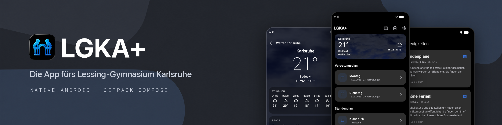

# LGKA+ for Android

[](https://play.google.com/store/apps/details?id=com.lgka)
[](https://github.com/lgka-app/lgka-android/actions/workflows/ci.yml)
[](LICENSE)

The school app for Lessing-Gymnasium Karlsruhe. Substitution plans, timetables, news, events and the weather, all in one place.

Looking for iOS? That's over at [lgka-ios](https://github.com/lgka-app/lgka-ios).

## What it does

- Substitution plans for today and tomorrow
- Your class timetable, opened right on your page
- School news and upcoming events
- Weather for Karlsruhe with a live sky
- Sick notes through the official school form
- Dark, light or automatic, with your own accent color

The app gets its data from [api.lgka.app](https://github.com/lgka-app/api), so it loads fast and still works offline with the last data it saw.

## Building it

You need JDK 17 or newer and the Android SDK (API 37). Android Studio works too.

```bash
./gradlew :app:installDebug
```

Run the tests with `./gradlew :core:test`.

To sign in you need the school's substitution plan login.

## Feedback

Found a bug? [Open an issue](https://github.com/lgka-app/lgka-android/issues) or write to [support@lgka.app](mailto:support@lgka.app).

## License

MIT. Made by [Luka Löhr](https://github.com/luka-loehr).
