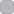

# 02 · Color

| | |
|---|---|
| **Last updated** | 2026-09-12 |
| **Applies to** | LGKA+ Android, Android 17 / Material 3 Expressive |
| **Owner** | Luka Löhr |
| **Status** | Normative — `app/src/main/kotlin/com/lgka/Theme.kt` is the single source of truth |

---

## 1. Principles

> Assign colors with tokens to indicate the element's color role, instead of using a hardcoded value.
> — [Android — Color for mobile design](https://developer.android.com/design/ui/mobile/guides/styles/color)

> Color roles ensure accessibility. The color system is built on accessible color pairings. These color pairs provide an accessible minimum 3:1 contrast.
> — [Material 3 — Color roles](https://m3.material.io/styles/color/roles)

LGKA+ follows both, with one intentional departure: the neutral surfaces are **not** derived from the
accent's tonal palette. They are fixed — pure black in dark, `#F2F2F7` in light — so that the app looks
identical in structure whichever of the five accents the student picks, and matches the iOS build.

- [x] Read every color through `MaterialTheme.colorScheme.*`.
- [x] Add a new literal hex only in `Theme.kt`, `Prefs.kt` (accents) or `WeatherScreen.kt` (sky), and document it here.
- [ ] Don't use `Color.Gray`, `Color.LightGray` or ad-hoc alpha blends for surfaces.
- [ ] Don't pair roles across groups — see the pairing rule in §6.

## 2. Accent palette — the five options

The student picks one accent during onboarding; it becomes `primary` **and** `secondary` in the scheme.

```kotlin
enum class Accent(val key: String, val color: Color, val labelRes: Int) {
    Blue("blue", Color(0xFF3770D4), R.string.accent_blue),
    Mint("mint", Color(0xFF45A88A), R.string.accent_mint),
    Lavender("lavender", Color(0xFF9B6BDF), R.string.accent_lavender),
    Rose("rose", Color(0xFFC47A7A), R.string.accent_rose),
    Peach("peach", Color(0xFFBF7F46), R.string.accent_peach);
```
<sub>`app/src/main/kotlin/com/lgka/Prefs.kt`</sub>

| Accent | Key | Hex | de label | en label | `onColor` |
|---|---|---|---|---|---|
|  Blue **(default)** | `blue` | `#3770D4` | Blau | Blue |  `#FFFFFF` |
|  Mint | `mint` | `#45A88A` | Mint | Mint |  `#0B0B0B` |
|  Lavender | `lavender` | `#9B6BDF` | Lavendel | Lavender |  `#0B0B0B` |
|  Rose | `rose` | `#C47A7A` | Rosé | Rose |  `#0B0B0B` |
|  Peach | `peach` | `#BF7F46` | Pfirsich | Peach |  `#0B0B0B` |

### 2.1 How `onPrimary` is chosen

`onColor` is computed, not authored — white is used only where it actually clears 4.5:1 against the accent:

```kotlin
/** WCAG-safe "on" color: white only where it reaches 4.5:1, otherwise near-black. */
val onColor: Color get() = if (contrastWithWhite() >= 4.5f) Color.White else Color(0xFF0B0B0B)
```
<sub>`app/src/main/kotlin/com/lgka/Prefs.kt`</sub>

Measured, using the same WCAG relative-luminance formula the code implements:

| Accent | vs `#FFFFFF` | vs `#000000` | vs `#1E1E1E` (dark card) | Resulting `onPrimary` |
|---|---:|---:|---:|---|
|  Blue | **4.74** | 4.43 | 3.52 | white |
|  Mint | 2.91 | 7.22 | 5.73 | near-black |
|  Lavender | 3.78 | 5.56 | 4.42 | near-black |
|  Rose | 3.28 | 6.41 | 5.09 | near-black |
|  Peach | 3.31 | 6.34 | 5.03 | near-black |

Only Blue reaches 4.5:1 against white, so only Blue gets `Color.White` as `onPrimary`. Every other
accent gets  `#0B0B0B`, which clears 4.5:1 comfortably in all five cases.

> **Warning — accent-as-text on light surfaces**
> The columns above are also the contrast of *accent-colored text* on a card. In the light theme,
> cards are white, so accent text scores 4.74 (Blue), 3.78 (Lavender), 3.31 (Peach), 3.28 (Rose) and
> **2.91 (Mint)**. The app uses accent text in several small labels — the "Mehr erfahren" link and the
> tag pills in `News.kt`, the date numeral in `Home.kt`'s `DateTile`, the PDF search feedback line in
> `PdfViewer.kt`. All of those are below the 4.5:1 that
> [Android — Make apps more accessible](https://developer.android.com/guide/topics/ui/accessibility/apps)
> asks for text under 18 sp, and Mint is below 3:1 even as non-text. None of them is the only carrier of
> its meaning (the link text is duplicated by the whole card being clickable, tags repeat information in
> the article), but **do not introduce new accent-colored body text on light surfaces**. Use
> `onSurface` / `onSurfaceVariant` and let the accent carry fills and icons.

## 3. Dark scheme

LGKA+'s `minSdk` is **29**, which is exactly the release where dark theme arrived:

> Dark theme is available in Android 10 (API level 29) and higher. It has the following benefits:
> - Reduces power usage by a significant amount, depending on the device's screen technology.
> - Improves visibility for users with low vision and those who are sensitive to bright light.
> - Makes it easier to use a device in a low-light environment.
>
> — [Android — Implement dark theme](https://developer.android.com/develop/ui/views/theming/darktheme)

The first benefit is why `background` and `surface` are **pure black** rather than a dark grey: on an OLED
panel those pixels are off. The scheme is defined in Kotlin rather than in night-qualified XML because the
Compose theme also has to honour the student's in-app choice, but the principle is the same one the doc states:

> Avoid using hardcoded colors or icons intended for use under a light theme. Use theme attributes or night-qualified resources instead.
> — [Android — Implement dark theme](https://developer.android.com/develop/ui/views/theming/darktheme)

The app's XML surface obeys it literally: `res/values-night/` carries night-qualified overrides for both
`themes.xml` and `colors.xml`. The remaining hardcoded literals are enumerated in §7 below.

```kotlin
darkColorScheme(
    primary = accent.color,
    onPrimary = accent.onColor,
    primaryContainer = accent.color.copy(alpha = 0.24f).compositeOver(Color.Black),
    onPrimaryContainer = Color.White,
    secondary = accent.color,
    …
    background = Color.Black,
    surface = Color.Black,
    …
)
```
<sub>`app/src/main/kotlin/com/lgka/Theme.kt`</sub>

| Role | Value | Swatch | Note |
|---|---|---|---|
| `primary` / `secondary` | accent | — | Same value; the app has no secondary hue. |
| `onPrimary` / `onSecondary` | `accent.onColor` | — | Computed, §2.1 |
| `primaryContainer` | accent @ 24 % over black | — | Derived per accent |
| `secondaryContainer` | accent @ 18 % over black | — | Derived per accent |
| `onPrimaryContainer` / `onSecondaryContainer` | `#FFFFFF` |  | |
| `background` / `surface` | `#000000` |  | True black, for OLED |
| `onBackground` / `onSurface` | `#FFFFFF` |  | 21:1 |
| `onSurfaceVariant` | `#B8B8BE` |  | 10.6:1 on black, 8.4:1 on `#1E1E1E` |
| `surfaceContainerLowest` | `#000000` |  | |
| `surfaceContainerLow` | `#141414` |  | |
| `surfaceContainer` | `#1E1E1E` |  | **The card fill** |
| `surfaceContainerHigh` | `#262626` |  | Bottom sheet |
| `surfaceContainerHighest` | `#2E2E2E` |  | |
| `outline` | `#8E8E93` |  | 6.44:1 on black |
| `outlineVariant` | `#2C2C2E` |  | Dividers only |

## 4. Light scheme

| Role | Value | Swatch | Note |
|---|---|---|---|
| `primary` / `secondary` | accent | — | |
| `primaryContainer` | accent @ 14 % over white | — | |
| `secondaryContainer` | accent @ 12 % over white | — | |
| `onPrimaryContainer` / `onSecondaryContainer` | `#1A1A1A` |  | |
| `background` / `surface` | `#F2F2F7` |  | Cool near-white page |
| `onBackground` / `onSurface` | `#1A1A1A` |  | 17.4:1 on white |
| `onSurfaceVariant` | `#5C5C63` |  | 6.63:1 on white, 5.94:1 on `#F2F2F7` |
| `surfaceContainerLowest` / `Low` / *(default)* | `#FFFFFF` |  | **All three are white** — cards float on the grey page |
| `surfaceContainerHigh` | `#F7F7FA` |  | |
| `surfaceContainerHighest` | `#EDEDF0` |  | |
| `outline` | `#8E8E93` |  | 2.92:1 on `#F2F2F7` — decorative use only in light |
| `outlineVariant` | `#D8D8DC` |  | Dividers only |

> **Note**
> The inversion is deliberate. In **dark**, the page is black and cards are lighter (`#1E1E1E`).
> In **light**, the page is grey (`#F2F2F7`) and cards are white. In both cases the card is the brighter
> surface, which is what M3 asks for: *"Give the most important content, tasks, or actions visual
> prominence through ample space and the brightest surface mapping."*
> — [Material 3 — Start building with M3 Expressive](https://m3.material.io/blog/building-with-m3-expressive)

## 5. Theme mode & dynamic color policy

```kotlin
val dark = when (prefs.themeMode) {
    "dark" -> true
    "light" -> false
    else -> isSystemInDarkTheme()
}
```
<sub>`app/src/main/kotlin/com/lgka/Theme.kt`; `themeMode` defaults to `"system"` in `Prefs.kt`</sub>

The three options and the default are the ones Android prescribes:

> You can let users change the app's theme while the app is running. The following are recommended options:
> - Light
> - Dark
> - System default (the recommended default option)
>
> — [Android — Implement dark theme](https://developer.android.com/develop/ui/views/theming/darktheme)

LGKA+ offers exactly these three, in the order **Dunkel · Auto · Hell**, and stores `"system"` as the default
(`Prefs.kt`). The mechanism differs from the Views-era `AppCompatDelegate.setDefaultNightMode()` the doc
describes — Compose reads `prefs.themeMode` and falls through to `isSystemInDarkTheme()` — but the user-facing
contract is identical.

> **Note**
> The doc recommends `UiModeManager#setApplicationNightMode` on API 31+ so *"the system [can] match the theme
> during the splash screen"* ([Android — Implement dark theme](https://developer.android.com/develop/ui/views/theming/darktheme)).
> LGKA+ does not call it, so an in-app override is not reflected in the splash. The splash itself does follow
> the **system** appearance — see §7.3 for the current behaviour and the remaining limitation.

**Dynamic color is deliberately not used.** `dynamicDarkColorScheme` / `dynamicLightColorScheme` are
never called; `res/values-v31/` is empty. The Compose guidance describes dynamic color as optional and
requires a static fallback either way:

> Even if you're using dynamic color, we strongly recommend creating a static scheme as a fallback if dynamic color isn't available to the user's device.
> — [Android — Color for mobile design](https://developer.android.com/design/ui/mobile/guides/styles/color)

**Rationale.** The wallpaper-derived scheme would override the student's explicit accent choice, which is
the app's only personalization surface and is mirrored one-to-one with the iOS build. Material's own
accessibility principle supports the choice:

> Honor individuals. Universal default experiences rarely meet everyone's needs. Introducing customizable features in a default experience allows room for individual adaptation.
> — [Material 3 — Accessible design overview](https://m3.material.io/foundations/accessible-design/overview)

- [x] Keep the five-accent picker as the personalization mechanism.
- [ ] Don't add `dynamicColorScheme` without also deciding what happens to a stored accent.

## 6. Role mapping in practice

| UI element | Role used | Source |
|---|---|---|
| Home cards, feature cards, settings groups | `surfaceContainer` via `Card` default | `Widgets.kt` `HomeCard`, `cardColors()` |
| Card title text | `onSurface` | `Home.kt` |
| Card subtitle / meta text | `onSurfaceVariant` | `Home.kt`, `News.kt` |
| 44 dp icon tile behind a card icon | `primary` @ 12 % (6 % when disabled) | `Widgets.kt` `IconTile` |
| Icon inside that tile | `primary` | `Widgets.kt` |
| Chevron, empty-state icons | `onSurfaceVariant` | `Home.kt` |
| Primary button fill / onboarding CTA | `primary` / `onPrimary` | `Onboarding.kt` |
| Login error text, destructive "Abmelden" | `error` | `Onboarding.kt`, `Settings.kt` |
| Dividers inside cards and sheets | `HorizontalDivider` default (`outlineVariant`) | `Settings.kt`, `News.kt` |
| Skeleton placeholder blocks | `onSurface` @ 8 % and 6 % | `Widgets.kt` `SkeletonRow` |

The M3 rule this table obeys:

> Do: pair and layer color roles as intended (primary / on primary, secondary container / on secondary container). Don't: improper mappings (primary / primary container, secondary container / on surface) become illegible as the contrast level changes.
> — [Material 3 — Color roles](https://m3.material.io/styles/color/roles)

and the divider rule:

> Don't use the outline color for dividers (use outline variant).
> — [Material 3 — Color roles](https://m3.material.io/styles/color/roles)

## 7. Hardcoded colors outside the scheme

These are the **only** literal colors allowed outside `Theme.kt` / `Prefs.kt`, and each has a reason.

### 7.1 Weather surfaces — white-on-sky

The weather card and the weather screen draw their own sky and put white text on it. Because the sky is
imagery, the text cannot use scheme roles; M3 permits this with a caveat:

> Layering text, icons, and images: it isn't recommended to place text or icons on images. If it's necessary, ensure the background image provides sufficient contrast for the text to meet accessibility standards. Add a translucent scrim or bounding shape beneath the text or icon to help ensure proper contrast.
> — [Material 3 — Cards guidelines](https://m3.material.io/components/cards/guidelines)

The app applies exactly that: every weather panel sits on a `Color.Black.copy(alpha = 0.32f)` scrim
(`GlassCard`, `StatTile` in `WeatherScreen.kt`).

| Purpose | Value | Swatch | Where |
|---|---|---|---|
| Sky gradient, day — top | `#2A6BD1` |  | `SkyBox` fallback, `WeatherScreen.kt` |
| Sky gradient, day — bottom | `#85B8F0` |  | same |
| Sky gradient, night — top | `#04081A` |  | same |
| Sky gradient, night — bottom | `#141F42` |  | same |
| Precipitation probability text | `#9FE8FF` |  | hourly & daily rows |
| Temperature bar — cold end | `#7FDBFF` |  | 3-day range bar |
| Temperature bar — warm end | `#FFDC00` |  | 3-day range bar |

The gradient pair is only the **fallback** below API 33. On Android 13+ the sky is an AGSL
`RuntimeShader` (`SKY_AGSL` in `WeatherScreen.kt`) that mixes its own day/night top and bottom colors in
linear float space and blends clouds, sun glow and stars over them, driven by two uniforms:

- `uCloud` — from `cloudiness(code)`: `0.12` for clear (WMO 0–1), `0.5` for partly cloudy (2), `0.95` for fog (45/48), `0.85` otherwise.
- `uDay` — 1 for day, 0 for night.

> **Note**
> The shader is a port of the iOS `Sky.metal`. Keeping both in sync is a parity requirement, not a
> style choice. If you change one, change the other.

### 7.2 Other literals

| Value | Swatch | Purpose | Where |
|---|---|---|---|
| `#2E7D32` |  | Login button flashes green for 500 ms on success | `Onboarding.kt` |
| `#FFD54F` `#FF8A65` `#F06292` `#4DD0E1` `#BA68C8` |      | New Year fireworks particles, 1 Jan only | `Settings.kt` |
| `#000000` |  | Weather screen root background behind the sky; `ic_launcher_background` (both appearances); `splash_background` (dark only, see §7.3) | `WeatherScreen.kt`, `res/values/colors.xml`, `res/values-night/colors.xml` |

> **Warning**
> Green-for-success is a semantic color with no role in the scheme and no text or icon equivalent
> at the moment it appears — the button shows a check icon at the same time, which is what keeps it
> from being color-only feedback. Android's guidance is explicit:
> *"Never make color the only affordance or indicator for an available action."*
> — [Android — Color for mobile design](https://developer.android.com/design/ui/mobile/guides/styles/color).
> Keep the icon if you touch this code.

### 7.3 The splash background follows the system appearance

```xml
<!-- Splash follows the system appearance: light here, black in values-night. -->
<color name="splash_background">#F2F2F7</color>
```
<sub>`app/src/main/res/values/colors.xml`</sub>

```xml
<color name="splash_background">#000000</color>
```
<sub>`app/src/main/res/values-night/colors.xml`</sub>

| Appearance | `splash_background` | Matches |
|---|---|---|
| Light |  `#F2F2F7` | the light `surface` / `background` role (§4) |
| Dark |  `#000000` | the dark `surface` / `background` role (§3) |

The splash therefore hands off to the first frame of the app on the **same color**, in both appearances.
This is the night-qualified-resource mechanism the guidance asks for:

> Avoid using hardcoded colors or icons intended for use under a light theme. Use theme attributes or night-qualified resources instead.
> — [Android — Implement dark theme](https://developer.android.com/develop/ui/views/theming/darktheme)

> If your app has a custom launch screen, you might need to modify it so that it reflects the selected theme. Remove any hardcoded colors such as background colors set programmatically to white. Use the `?android:attr/colorBackground` theme attribute instead.
> — [Android — Implement dark theme](https://developer.android.com/develop/ui/views/theming/darktheme)

> **Note**
> `ic_launcher_background` stays  `#000000` in both appearances, and correctly so — a launcher icon's
> background layer is a constant, not a themed surface. Only the splash follows the system. See
> [01 · Brand identity §2](01-brand-identity.md#2-app-icon).

#### Known limitation — an in-app override is not reflected

The splash is chosen by the **system** appearance. A student who sets **Hell** inside the app while the device
is in system dark mode still gets the black splash for that fraction of a second, then lands on the light
theme. Android provides the fix and the app does not yet call it:

> On API level 31 and above, use `UiModeManager#setApplicationNightMode` to let the system know what theme your app runs. This lets the system match the theme during the splash screen.
> — [Android — Implement dark theme](https://developer.android.com/develop/ui/views/theming/darktheme)

This is a tracked follow-up, not a defect: the common cases (system default, or an in-app choice matching the
system) are all correct, and the mismatch lasts only as long as the splash. Calling
`setApplicationNightMode` whenever `prefs.themeMode` changes would close it on API 31+; devices on API 29–30
have no equivalent and would keep the current behaviour.

#### The icon art on two grounds

Moving the light splash off black means the foreground art now sits on a near-white ground half the time.
Measured against the opaque pixels of `mipmap-xxxhdpi/ic_launcher_foreground.png`:

| Art | Against `#F2F2F7` | Against `#000000` |
|---|---:|---:|
| Median opaque color `#0A90D9` | 3.13 | 6.00 |
| Lightest highlights `#DFFFFF` (≈5 % of the art) | 1.06 | — |

The silhouette reads on both grounds because its mass is the mid-blue body. The specular highlight strokes
along the tops of the lions and the arch effectively disappear on the light ground, so the light splash shows
a flatter version of the same mark. Acceptable for a sub-second launch image; worth knowing before anyone
reuses this asset on a light surface at rest.

- [x] Give any new color in `values/colors.xml` a `values-night` variant unless it is genuinely appearance-independent.
- [ ] Don't assume the splash matches the in-app theme override until `setApplicationNightMode` is wired up.

## 8. System bar colors

The XML themes make both bars transparent and disable navigation-bar contrast enforcement, with a
light/dark icon variant per theme:

```xml
<item name="android:statusBarColor">@android:color/transparent</item>
<item name="android:navigationBarColor">@android:color/transparent</item>
<item name="android:enforceNavigationBarContrast">false</item>
```
<sub>`res/values/themes.xml` (light, `windowLightStatusBar=true`) and `res/values-night/themes.xml` (dark, `false`)</sub>

See [04 · Layout & spacing](04-layout-and-spacing.md#5-system-bars-and-edge-to-edge) for the edge-to-edge rules this serves.

## Related

[03 · Typography](03-typography.md) · [05 · Material 3 Expressive](05-material-expressive.md) · [10 · Accessibility](10-accessibility.md) · [14 · Android reference](14-android-reference.md)

## Sources

| Source | Accessed |
|---|---|
| [Material 3 — Color roles](https://m3.material.io/styles/color/roles) | 2026-09-12 |
| [Material 3 — Cards guidelines](https://m3.material.io/components/cards/guidelines) | 2026-09-12 |
| [Material 3 — Accessible design overview](https://m3.material.io/foundations/accessible-design/overview) | 2026-09-12 |
| [Material 3 — Start building with M3 Expressive](https://m3.material.io/blog/building-with-m3-expressive) | 2026-09-12 |
| [Android — Color for mobile design](https://developer.android.com/design/ui/mobile/guides/styles/color) | 2026-09-12 |
| [Android — Make apps more accessible](https://developer.android.com/guide/topics/ui/accessibility/apps) | 2026-09-12 |
| [Compose — Material Design 3 in Compose](https://developer.android.com/develop/ui/compose/designsystems/material3) | 2026-09-12 |
| [Android — Implement dark theme](https://developer.android.com/develop/ui/views/theming/darktheme) | 2026-09-12 |
| App source: `kotlin/com/lgka/{Theme,Prefs,Widgets,Home,News,WeatherScreen,Onboarding,Settings,PdfViewer}.kt`, `res/values/{colors,themes}.xml`, `res/values-night/{colors,themes}.xml`, `res/mipmap-xxxhdpi/ic_launcher_foreground.png`, `app/build.gradle.kts` | 2026-09-12 |
