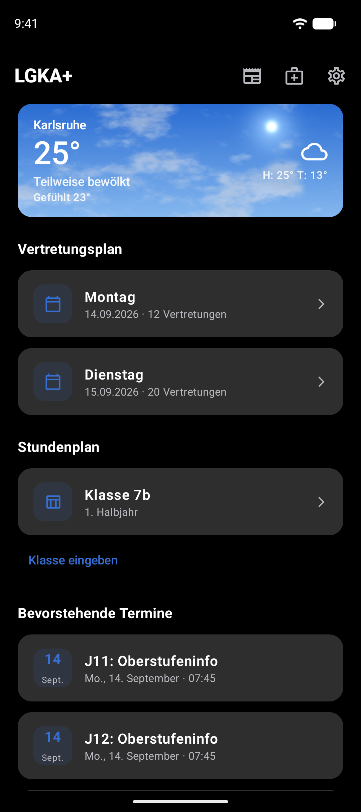
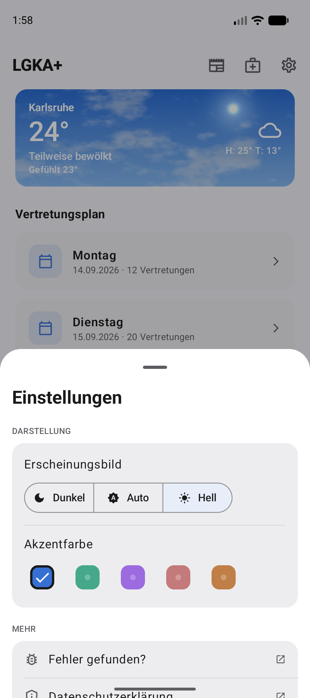
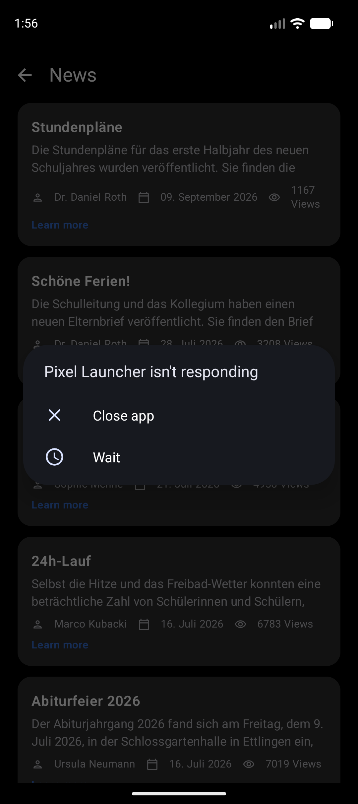

# 06 · Components

| | |
|---|---|
| **Last updated** | 2026-09-12 |
| **Applies to** | LGKA+ Android, Android 17 / Material 3 Expressive |
| **Owner** | Luka Löhr |
| **Status** | Normative |

---

The shared primitives live in `app/src/main/kotlin/com/lgka/Widgets.kt`. Use them. A new screen that
re-implements `HomeCard` or `Loading` is a review blocker.

<table>
<tr>
<td align="center"><br><sub>de · phone · dark · cards & app bar</sub></td>
<td align="center"><br><sub>de · phone · light · bottom sheet</sub></td>
<td align="center"><br><sub>en · phone · dark · news cards</sub></td>
</tr>
</table>

## 1. Cards

> Use a card to display content and actions on a single topic. Cards should be easy to scan for relevant and actionable information.
> — [Material 3 — Cards guidelines](https://m3.material.io/components/cards/guidelines)

The app uses the **filled** variant throughout (`Card` with `CardDefaults.cardColors()`), so every card
reads as the same kind of object.

> There are three card variants: elevated, filled, outlined. Each provides the same legibility and functionality, so the variant you use depends on style alone.
> — [Material 3 — Cards guidelines](https://m3.material.io/components/cards/guidelines)

### 1.1 `HomeCard` — the workhorse

```kotlin
@Composable
fun HomeCard(
    modifier: Modifier = Modifier,
    onClick: (() -> Unit)? = null,
    enabled: Boolean = true,
    content: @Composable RowScope.() -> Unit,
) {
    val row: @Composable () -> Unit = {
        Row(
            Modifier.fillMaxWidth().heightIn(min = 76.dp).padding(horizontal = 18.dp, vertical = 12.dp),
            verticalAlignment = Alignment.CenterVertically, content = content,
        )
    }
    if (onClick != null) {
        Card(onClick = onClick, enabled = enabled, shape = CardShape, modifier = modifier) { row() }
    } else {
        Card(shape = CardShape, modifier = modifier) { row() }
    }
}
```
<sub>`app/src/main/kotlin/com/lgka/Widgets.kt`</sub>

The whole card is one target, which is what M3 asks for:

> Actions: cards can be one large touch target triggering an expanded detail screen.
> — [Material 3 — Cards guidelines](https://m3.material.io/components/cards/guidelines)

### 1.2 The card catalogue

| Card | Content | Interaction | Source |
|---|---|---|---|
| **Weather** | Sky background, city, temperature, condition, feels-like, icon, high/low | Opens the weather screen; `contentDescription` + `Role.Button` on the card | `Home.kt` `WeatherRow` |
| **Substitution (today / tomorrow)** | Calendar tile, weekday, `date · N Vertretungen` | Opens the PDF viewer; `enabled = plan.canDisplay` | `Home.kt` `SubCard` |
| **Substitution — per-day failure** | Refresh tile, "Fehler beim Laden", refresh glyph | Retries that one day | `Home.kt` `SubCard` |
| **Substitution — whole-section failure** | Centred `CloudOff` 40 dp, headline, hint, outlined retry button, 24 dp padding | Retries the section | `Home.kt` `SubstitutionCards` |
| **Schedule — no class set** | School tile, "In welcher Klasse bist du?", "Tippe, um deine Klasse festzulegen" | Opens the class dialog | `Home.kt` `ScheduleCard` |
| **Schedule — class set** | Table tile, class name, semester, chevron *or* 18 dp spinner | Fetches and opens the timetable PDF | `Home.kt` `ScheduleCard` |
| **Event** | `DateTile` (day numeral in accent, 10 sp month), title (max 2 lines), `Wed, 4. März · 18:00` | None — informational, merged semantics | `Home.kt` `EventsColumn` |
| **News list item** | Title, 2-line description, meta row, up to 3 tag pills, "Mehr erfahren", 16 dp padding | Opens the article | `News.kt` `NewsCard` |
| **Recommended article** | Title + `author · date` | Opens that article | `News.kt` |
| **Onboarding feature** | 48 dp tile, title, description, 16 dp padding | None — merged semantics | `Onboarding.kt` `FeaturesStep` |
| **Krankmeldung info** | 52 dp tile, paragraph, 20 dp padding | None | `WebScreen.kt` |
| **Settings group** | Column of tiles or controls, inset dividers | Per-row | `Settings.kt` |
| **Weather glass card / stat tile** | Black 32 % scrim, 18 dp radius, 14 dp padding | None | `WeatherScreen.kt` |

- [x] A card is one subject. If it needs two independent actions, it needs two cards.
- [ ] Don't put a scrolling container inside a card — M3 forbids it, and the app never does:
      *"On a mobile device, cards can't internally scroll, as it could cause two scroll bars to be displayed."*
      — [Material 3 — Cards guidelines](https://m3.material.io/components/cards/guidelines)

## 2. Buttons

| Variant | Emphasis | Used for |
|---|---|---|
| `Button` (filled) | High | Onboarding "Weiter"/"Los geht's", "Anmelden", "Zur Krankmeldung", "Erneut versuchen" in full-screen error states |
| `OutlinedButton` | Medium | Section retry inside the substitution error card; article download / external links |
| `TextButton` | Low | "Klasse eingeben" under the schedule card; dialog confirm / dismiss |
| `IconButton` | — | Top app bar actions; PDF search navigation; retry inside a card row |

> An extended floating action button for the highest emphasis action […] A filled button for a high emphasis action […] A text button for a low emphasis action
> — [Compose — Material Design 3 in Compose](https://developer.android.com/develop/ui/compose/designsystems/material3)

Primary CTA geometry, identical in `Onboarding.kt` and `WebScreen.kt`:

```kotlin
Button(onClick = onContinue, modifier = Modifier.fillMaxWidth().heightIn(min = 52.dp).testTag("onboarding.continue"),
       shape = RoundedCornerShape(16.dp)) {
    Text(button, fontWeight = FontWeight.SemiBold)
}
```
<sub>`app/src/main/kotlin/com/lgka/Onboarding.kt`</sub>

The login button is the one stateful button in the app. It swaps its own content between a label, a
22 dp spinner and a check icon, and tints its container per state:

| State | Container | Content |
|---|---|---|
| Idle | `primary` | "Anmelden" |
| Loading | `primary` | 22 dp `CircularProgressIndicator` in `onPrimary` |
| Success (500 ms) |  `#2E7D32` | `Icons.Filled.Check` |
| Failure (700 ms) | `error` | Label, plus an error message above the button |

<sub>`app/src/main/kotlin/com/lgka/Onboarding.kt` `AuthScreen`</sub>

## 3. Segmented buttons — theme mode

The only selection control in the app. Three options, icon + label, correct end shapes:

```kotlin
SingleChoiceSegmentedButtonRow {
    options.forEachIndexed { i, (mode, icon, label) ->
        SegmentedButton(
            selected = prefs.themeMode == mode,
            onClick = { prefs.themeMode = mode },
            shape = SegmentedButtonDefaults.itemShape(index = i, count = options.size),
            icon = { Icon(icon, null, Modifier.size(16.dp)) }) {
            Text(stringResource(label))
        }
    }
}
```
<sub>`app/src/main/kotlin/com/lgka/Onboarding.kt` `ThemeModeRow` — reused verbatim inside the settings sheet</sub>

Order is **Dunkel · Auto · Hell** (`DarkMode`, `BrightnessAuto`, `LightMode`), dark first. `SegmentedButton`
supplies the selected-state semantics and the 48 dp target itself.

## 4. Accent picker

Five swatches in a row, each a radio-button target with a spoken color name:

```kotlin
Box(
    Modifier.size(maxOf(swatchSize, 48).dp)
        .selectable(selected = selected, role = Role.RadioButton, onClick = {
            haptic.performHapticFeedback(HapticFeedbackType.SegmentTick)
            prefs.accentColor = accent.key
        })
        .semantics { contentDescription = if (selected) "$name, $selectedLabel" else name },
```
<sub>`app/src/main/kotlin/com/lgka/Onboarding.kt` `AccentRow`</sub>

| Context | Visual swatch | Touch target |
|---|---|---|
| Onboarding step 3 | 56 dp, 18 dp radius | 56 dp |
| Settings sheet | 32 dp, 10 dp radius | **48 dp** (`maxOf(swatchSize, 48)`) |

Selection is shown three ways at once — a 3 dp `onSurface` border (white in dark, near-black in light), a
check icon in `accent.onColor`, and the spoken ", ausgewählt" — so it is never color-only. Unselected swatches
carry a small white 24 % dot, which is what keeps the row reading as a set of five choices rather than five
decorations.

## 5. Bottom sheet — Settings

`ModalBottomSheet` is the settings surface; there is no settings screen.

```
        ▁▁▁▁                      ModalBottomSheet drag handle (component default)
Einstellungen                     headlineSmall / Bold / heading()
DARSTELLUNG                       labelSmall / onSurfaceVariant
┌─ Card ──────────────────────────────────────┐
│ Erscheinungsbild                            │
│ [Dunkel | Auto | Hell]                      │
│ ──────────────── divider ─────────────────  │
│ Akzentfarbe                                 │
│ ● ● ● ● ●   (32 dp swatches)                │
└─────────────────────────────────────────────┘
MEHR                              labelSmall / onSurfaceVariant
┌─ Card ──────────────────────────────────────┐
│ 🐞 Fehler gefunden?                      ↗  │
│ 🔒 Datenschutzerklärung                  ↗  │
│ ℹ️ Impressum                              ↗  │
│ ↩ Abmelden                                  │
└─────────────────────────────────────────────┘
        © 2026 Luka Löhr • v3.0.0
```
<sub>`app/src/main/kotlin/com/lgka/Settings.kt`</sub>

The drag handle is the `ModalBottomSheet` default and is not overridden; it is the only affordance telling a
student the sheet can be swiped away.

Each `SettingsTile` is a 48 dp-minimum `Row` with `clickable(role = Role.Button)`, a 20 dp leading icon in
`onSurfaceVariant`, and a 14 dp `OpenInNew` glyph when the destination leaves the app. "Abmelden" has no
external glyph and opens an `AlertDialog` whose confirm label is tinted `error`.

> **Note**
> The `OpenInNew` glyph is the app's consistent signal for "this leaves LGKA+". It appears in the
> settings tiles, the news article top bar, and over article images. Keep that contract.

## 6. Dialogs

| Dialog | Purpose | Source |
|---|---|---|
| `ClassDialog` | Title, single-line `OutlinedTextField` capped at 3 characters, "Speichern" / "Abbrechen" | `Home.kt` |
| Logout confirmation | Title, body, destructive confirm in `error`, "Abbrechen" | `Settings.kt` |
| PDF viewer | Full-screen `Dialog(usePlatformDefaultWidth = false, decorFitsSystemWindows = false)` wrapping a `Surface` + `Scaffold` | `PdfViewer.kt` |

Input is normalised on commit, not while typing: `input.trim().lowercase(Locale.ROOT)`.

## 7. Text fields

All three text fields are `OutlinedTextField`, single-line, with deliberate IME configuration:

| Field | Leading icon | Keyboard | IME action |
|---|---|---|---|
| Username | `Icons.Outlined.Person` | `Text`, `autoCorrectEnabled = false` | `Next` |
| Password | `Icons.Outlined.Lock` | `Password`, `PasswordVisualTransformation()` | `Go` → submits |
| PDF search | — (placeholder "Im PDF suchen") | default | `Search` → searches |
| Class input | — (placeholder "Gib deine Klasse ein") | default | default |

- [x] Give every field a `label` or a `placeholder` from a string resource.
- [x] Wire the IME action to the action the field implies.
- [ ] Don't enable autocorrect on a credential field.

## 8. Top app bars

`TopAppBar` (small, non-scrolling) on home, news list, news detail, PDF viewer, Krankmeldung info and the
in-app browser.

| Screen | Navigation icon | Title | Actions |
|---|---|---|---|
| Home | — | `LGKA+` (`ExtraBold`) | Newspaper · MedicalServices · Settings |
| News list | Back arrow | "Neuigkeiten" | — |
| News detail | Back arrow | *(empty)* | `OpenInNew` |
| PDF viewer | **Close (×)** | Plan title, `maxLines = 1` | Search · Share |
| Krankmeldung info | Back arrow | "Hinweis zur Krankmeldung" | — |
| In-app browser | **Close (×)** | Screen title | — |
| Weather | Back arrow, floating over the sky | "Wetter Karlsruhe" with `heading()` | *(debug-only long-press menu)* |

> **Note**
> Back arrow versus close is a deliberate distinction: **back** for a destination in the back stack,
> **close** for a modal that covers everything (PDF dialog, WebView). Keep it.

The weather screen has no `TopAppBar` at all — a bare `Row` floats over the sky so the gradient runs to the
top edge. That is the only screen allowed to do this.

## 9. Lists & empty states

| Case | Component |
|---|---|
| Home hub | `LazyColumn`, 12 dp gaps, inside a `PullToRefreshBox` |
| News list | `LazyColumn` keyed by `it.url`, inside a `PullToRefreshBox` |
| PDF pages | `LazyColumn` keyed by page index, each page `aspectRatio`-reserved before its bitmap arrives |
| Onboarding features | `LazyColumn`, 12 dp gaps |

Four distinct non-content states exist, and each is a different component — never a blank screen:

| State | Rendering |
|---|---|
| **Loading, list shape known** | `SkeletonRow()` ×1 / ×2 / ×4 — 44 dp block + two grey bars at 8 % / 6 % `onSurface` |
| **Loading, nothing known** | Centred `Loading()` |
| **Empty** | `HomeCard` with an outline icon and one line in `onSurfaceVariant` ("Keine Termine verfügbar") |
| **Error** | `ErrorState(message, onRetry)` — bold message + filled "Erneut versuchen", or the larger `CloudOff` card for the substitution section |

- [x] Every remote-data surface must handle all four.
- [x] Every error state must offer a retry.
- [ ] Don't show a spinner where the shape of the result is already known — use a skeleton.

## Related

[04 · Layout & spacing](04-layout-and-spacing.md) · [08 · Motion & feedback](08-motion-and-feedback.md) · [10 · Accessibility](10-accessibility.md) · [13 · Screens](13-screens.md)

## Sources

| Source | Accessed |
|---|---|
| [Material 3 — Cards guidelines](https://m3.material.io/components/cards/guidelines) | 2026-09-12 |
| [Compose — Material Design 3 in Compose](https://developer.android.com/develop/ui/compose/designsystems/material3) | 2026-09-12 |
| [Compose — Accessibility API defaults](https://developer.android.com/develop/ui/compose/accessibility/api-defaults) | 2026-09-12 |
| [Android — Layout basics](https://developer.android.com/design/ui/mobile/guides/layout-and-content/layout-basics) | 2026-09-12 |
| App source: `kotlin/com/lgka/{Widgets,Home,News,Settings,Onboarding,WeatherScreen,PdfViewer,WebScreen}.kt` | 2026-09-12 |
