# 13 · Screens

| | |
|---|---|
| **Last updated** | 2026-09-12 |
| **Applies to** | LGKA+ Android, Android 17 / Material 3 Expressive |
| **Owner** | Luka Löhr |
| **Status** | Descriptive — the reference for what each screen contains and why |

---

## How to read this file

Screenshots come from the instrumented suite and live at a stable path:

```
app_store_assets/screenshots/<de|en>/android/<phone|tablet>/<dark|light>/NN_name.png
```

| NN_name | Screen | Test |
|---|---|---|
| `01_welcome` | Onboarding step 1 | `t01Welcome` |
| `02_home` | Home hub | `t02Home` |
| `03_weather` | Weather | `t03Weather` |
| `04_news` | News list | `t04News` |
| `05_news_detail` | News article | `t05NewsDetail` |
| `06_plan` | PDF viewer | `t06Plan` |
| `07_settings` | Settings bottom sheet | `t07Settings` |
| `08_after_login` | Home hub, reached through the real login flow | `t08LoginFlow` |

<sub>`app/src/androidTest/kotlin/com/lgka/ScreenshotTest.kt`, driven by `scripts/screenshots.sh`</sub>

Every capture uses accent **blue**, a clean demo status bar (09:41, full battery, full signal, no
notifications) and `animator_duration_scale 0`. Two form factors (`pixel_9`, `pixel_tablet`) × two themes ×
two locales = 32 images per full run.

> **Warning**
> `06_plan` is skipped by `assumeTrue` when neither substitution plan is publishable that day, and
> `08_after_login` is skipped when `LGKA_LOGIN` is not set. A missing file for those two is expected, not a
> failure.

---

## 01 · Welcome

<table>
<tr>
<td align="center">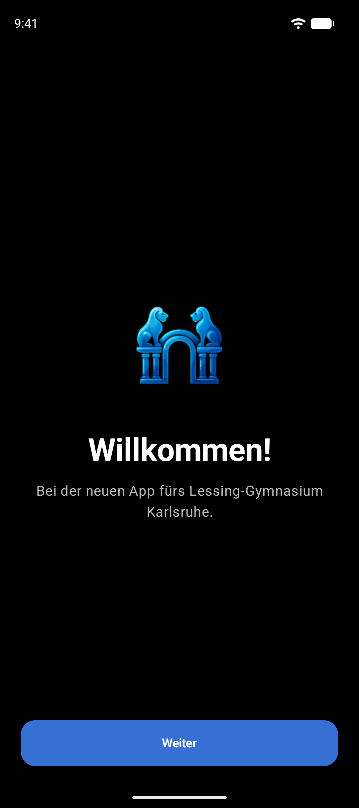<br><sub>de · phone · dark</sub></td>
<td align="center">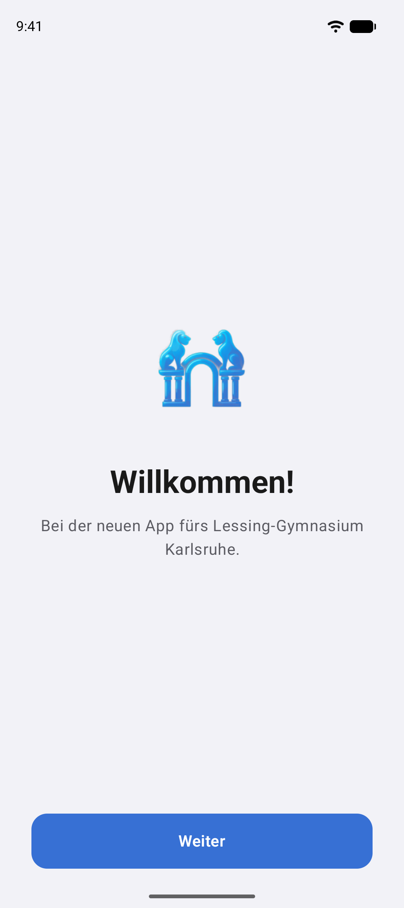<br><sub>de · phone · light</sub></td>
<td align="center"><br><sub>en · phone · dark</sub></td>
<td align="center">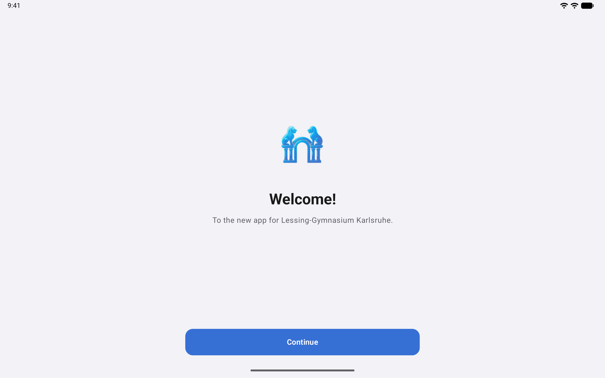<br><sub>en · tablet · light</sub></td>
</tr>
</table>

**Composition.** Centred column: 180 dp app logo, `displaySmall`/`Bold` headline "Willkommen!", a
`onSurfaceVariant` subtitle, flexible space, full-width CTA "Weiter". 24 dp padding, `safeDrawingPadding()`.

**Design notes**
- The only screen where the logo appears inside the app. It establishes identity before anything is asked for.
- No progress indicator. The flow is four taps; a progress row would add weight without information.
- Headline carries `heading()`; the logo carries `a11y_app_logo`.

**Source** `Onboarding.kt` `WelcomeStep` · **Related** [11 · Onboarding](11-onboarding-login-and-privacy.md)

---

## 02 · Home hub

<table>
<tr>
<td align="center"><br><sub>de · phone · dark</sub></td>
<td align="center">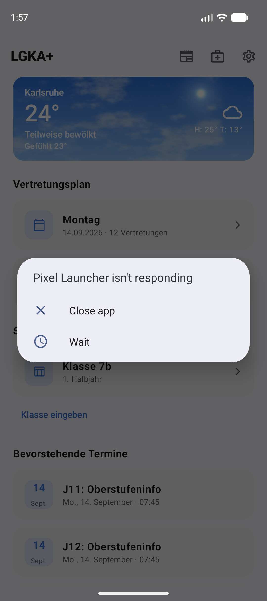<br><sub>de · phone · light</sub></td>
<td align="center">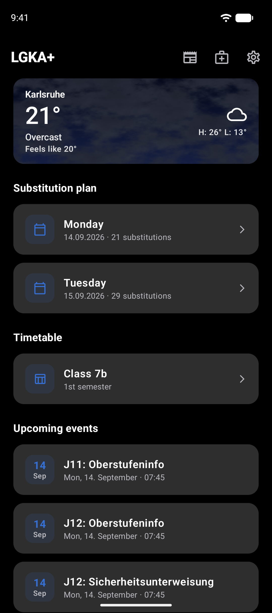<br><sub>en · phone · dark</sub></td>
<td align="center">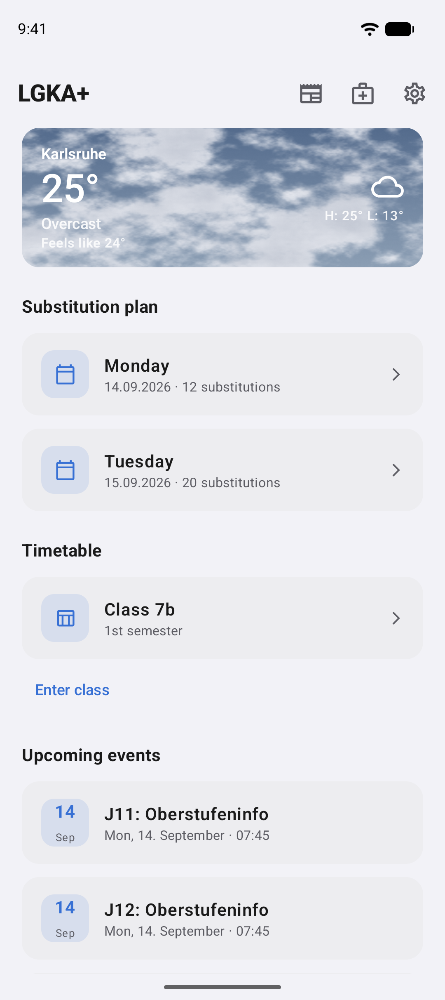<br><sub>en · phone · light</sub></td>
</tr>
<tr>
<td align="center">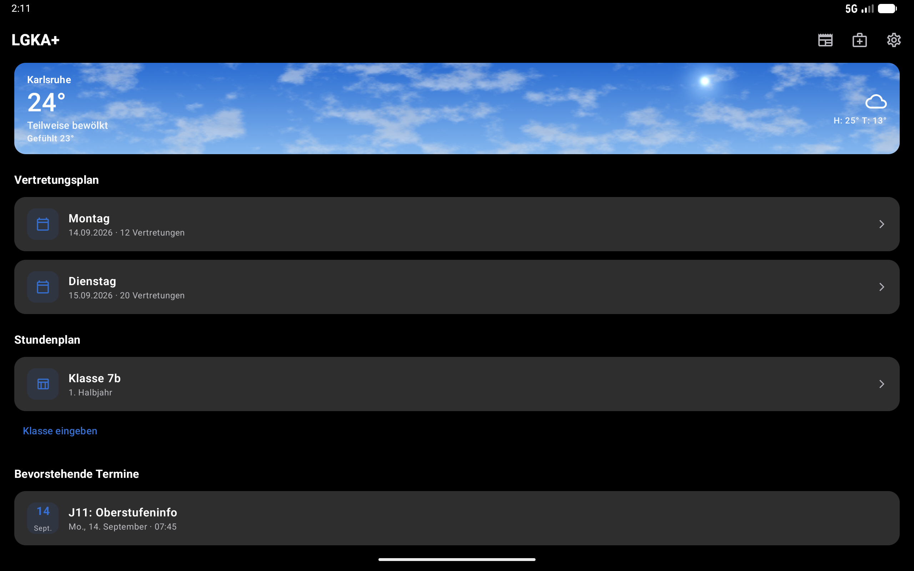<br><sub>de · tablet · dark</sub></td>
<td align="center">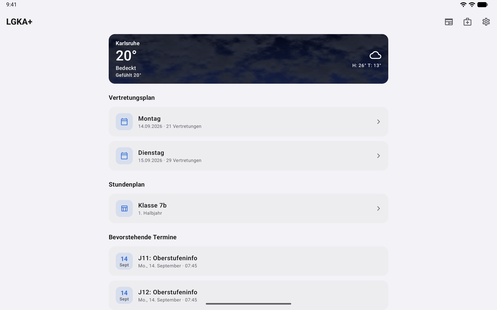<br><sub>de · tablet · light</sub></td>
<td align="center"><br><sub>en · tablet · dark</sub></td>
<td align="center"><br><sub>en · tablet · light</sub></td>
</tr>
</table>

**Composition.** `Scaffold` with a `TopAppBar` (`LGKA+` in `ExtraBold`, three action icons) over a
`PullToRefreshBox` wrapping a `LazyColumn` at a 20 dp margin with 12 dp gaps:

1. Weather card — full-bleed sky, 112 dp minimum, the only card with imagery
2. `SectionHeader` **Vertretungsplan** → today card, tomorrow card
3. `SectionHeader` **Stundenplan** → class card (+ "Klasse eingeben" `TextButton`)
4. `SectionHeader` **Bevorstehende Termine** → up to four event cards
5. 16 dp tail spacer

**Design notes**
- The three app bar actions are the three destinations that are not content: news, sick note, settings.
- The weather card sits above the first section header on purpose — it is the opening image, not a list item.
- Events are capped at four (`vm.events.take(4)`). The hub is a summary, not an archive.
- Pull-to-refresh fires a `LongPress` haptic and refetches everything.
- On tablet, cards stretch full width. See [04 · Layout §6](04-layout-and-spacing.md#6-large-screens--a-known-gap).

**Source** `Home.kt` · **Related** [06 · Components](06-components.md)

---

## 03 · Weather

<table>
<tr>
<td align="center"><br><sub>de · phone · dark</sub></td>
<td align="center">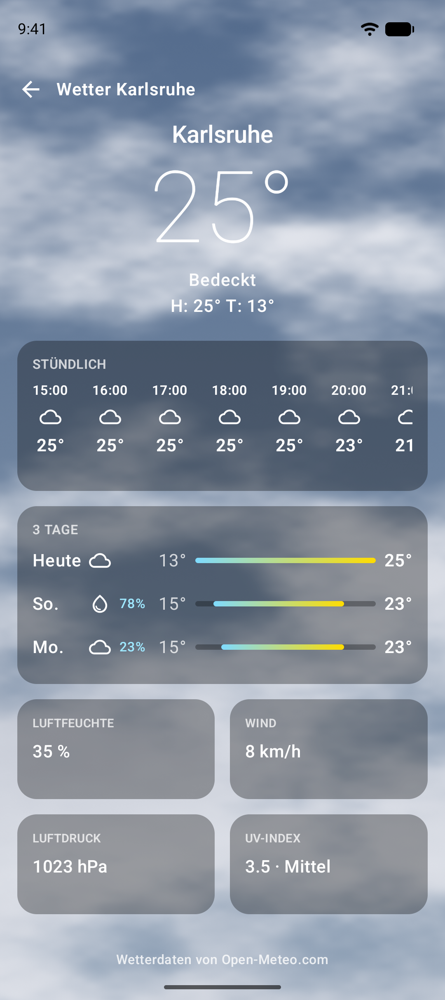<br><sub>de · phone · light</sub></td>
<td align="center">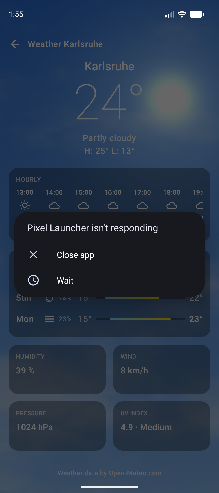<br><sub>en · phone · dark</sub></td>
<td align="center">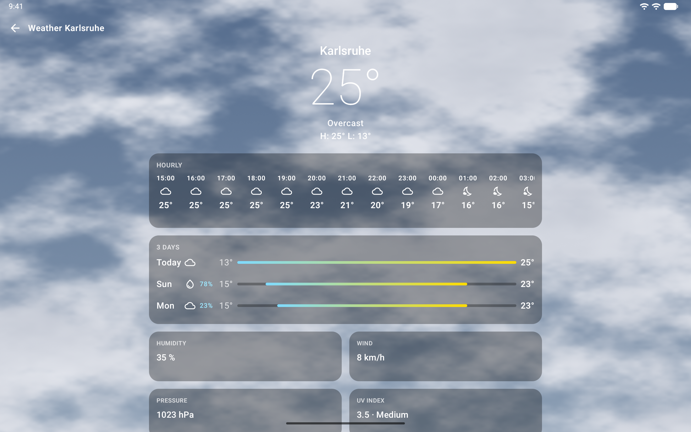<br><sub>en · tablet · dark</sub></td>
</tr>
</table>

**Composition.** Full-bleed animated sky behind a scrolling column at a 16 dp margin:

| Block | Content |
|---|---|
| Floating top bar | Back arrow + "Wetter Karlsruhe", white, no `TopAppBar` container |
| Hero | City (`titleLarge`), 92 sp `Thin` temperature, condition, high/low |
| Hourly | `GlassCard`, horizontally scrolling columns: time, icon, precipitation %, temperature |
| 3-day | `GlassCard`, rows: day, icon, precipitation %, low, gradient range bar, high |
| Stats | 2×2 grid of `StatTile`: humidity, wind, pressure, UV index |
| Attribution | "Wetterdaten von Open-Meteo.com", tappable, ≥ 48 dp |

**Design notes**
- The app's first hero moment. Sky is an AGSL `RuntimeShader` on API 33+, a two-stop vertical gradient below.
- Rain and snow particles are drawn on a `Canvas` over the sky, only on this screen (`particles = true`);
  the home card passes `particles = false`.
- All panels are `Color.Black.copy(alpha = 0.32f)` scrims at an 18 dp radius — the translucent-scrim
  technique M3 requires for text over imagery.
- Theme-independent: the screen is dark in both light and dark mode, because the sky decides the palette.
- Range bar gradient runs  `#7FDBFF` →  `#FFDC00`.
- Hourly columns and daily rows are merged into single TalkBack sentences via `a11y_hour` / `a11y_day`.

**Source** `WeatherScreen.kt` · **Related** [02 · Color §7.1](02-color.md#71-weather-surfaces--white-on-sky)

---

## 04 · News list

<table>
<tr>
<td align="center">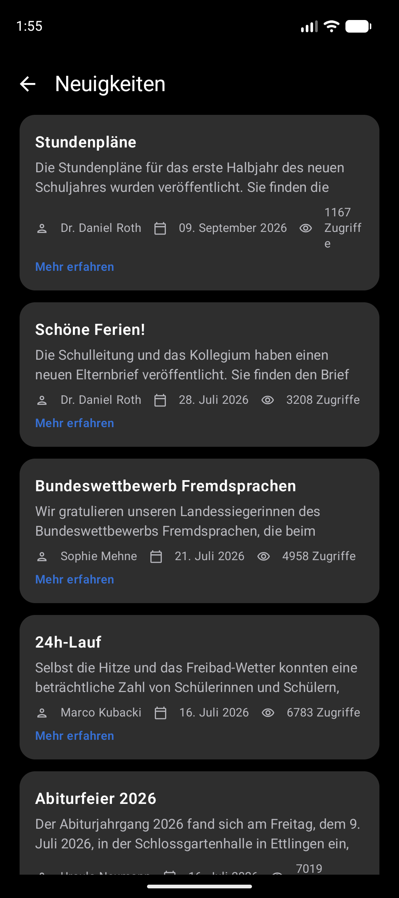<br><sub>de · phone · dark</sub></td>
<td align="center"><br><sub>de · phone · light</sub></td>
<td align="center"><br><sub>en · phone · dark</sub></td>
<td align="center">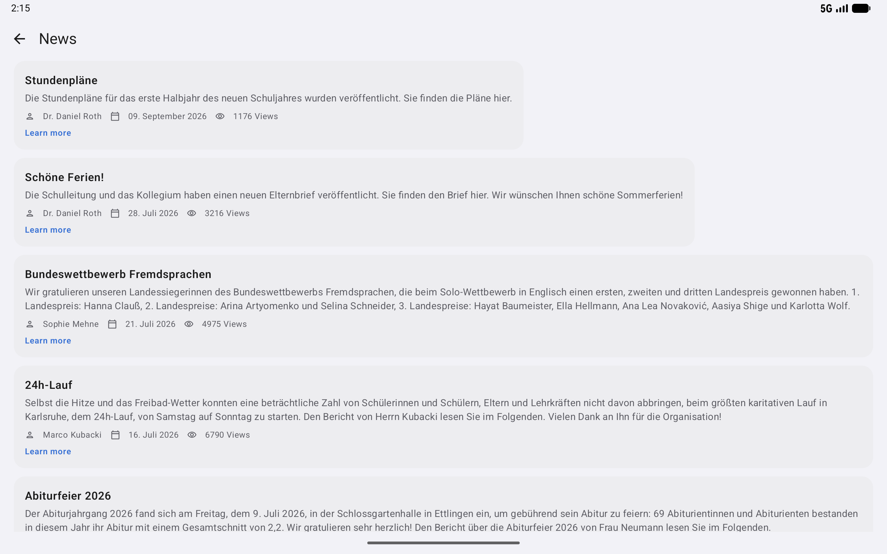<br><sub>en · tablet · light</sub></td>
</tr>
</table>

**Composition.** `TopAppBar` with a back arrow and the title "Neuigkeiten"; `PullToRefreshBox` over a
`LazyColumn` keyed by article URL, 20 dp margin, 12 dp gaps. Each card: title (`SemiBold`),
2-line description, meta row (`Person` · author, `CalendarToday` · date, `Visibility` · views), up to three
pill-shaped tags in `primary` @ 12 %, and a "Mehr erfahren" label in `primary`.

**Design notes**
- No images in the list. Titles and metadata scan faster and the list never waits on network images.
- Tags are capped at three so the card height stays stable.
- All four data states are handled: `Loading()`, empty text, `ErrorState` with retry, content.

**Source** `News.kt` `NewsListScreen` · **Related** [06 · Components §1.2](06-components.md#12-the-card-catalogue)

---

## 05 · News article

<table>
<tr>
<td align="center">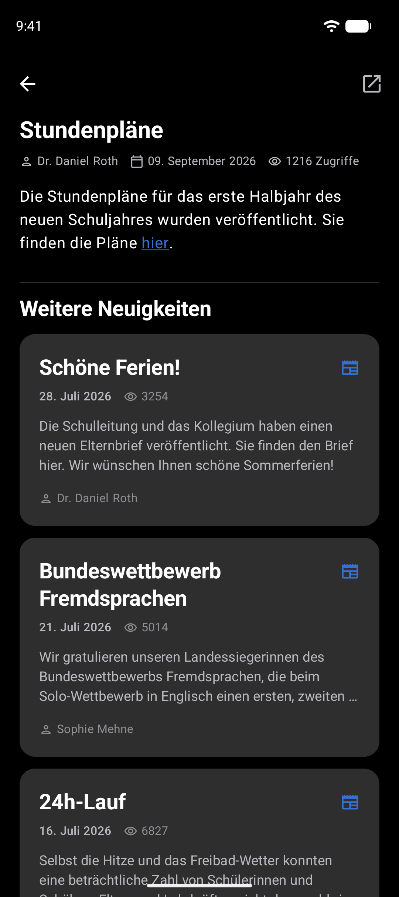<br><sub>de · phone · dark</sub></td>
<td align="center">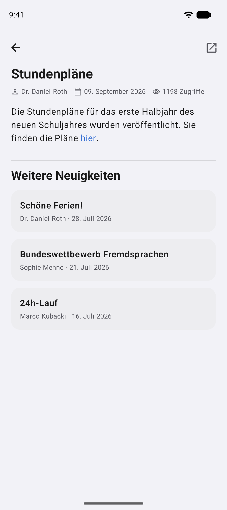<br><sub>de · phone · light</sub></td>
<td align="center"><br><sub>en · phone · dark</sub></td>
<td align="center">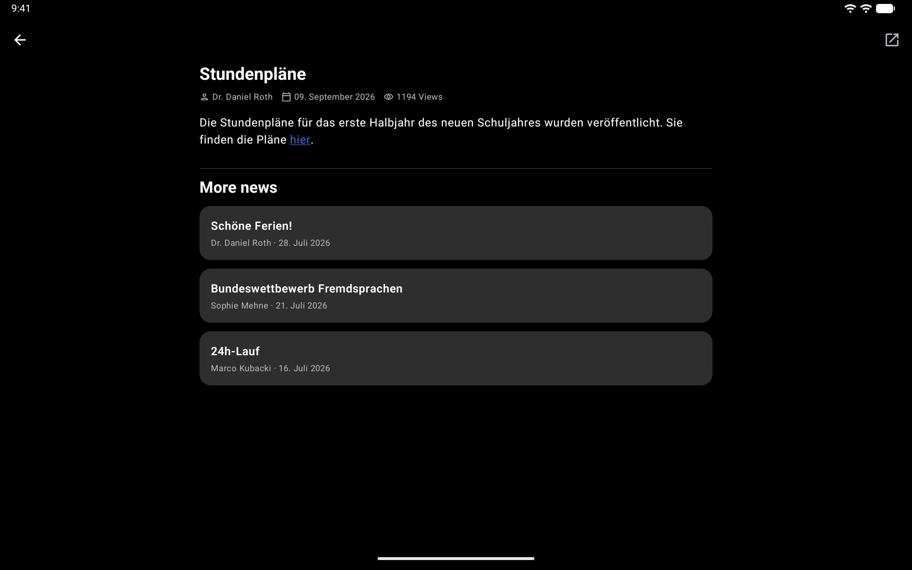<br><sub>en · tablet · dark</sub></td>
</tr>
</table>

**Composition.** `TopAppBar` with **no title** (back arrow, `OpenInNew` action), then a `LazyColumn`:
`headlineSmall`/`Bold` title with `heading()`, meta row, `bodyLarge` body with inline links, images,
outlined link/download buttons, a divider, and "Weitere Neuigkeiten" with up to three related cards.

**Design notes**
- The empty app bar title is deliberate: the article headline is right below it and would be duplicated.
- Embedded links are built with `buildAnnotatedString` + `LinkAnnotation.Url`, styled `primary` +
  underline — never color alone.
- Images are tappable with `onClickLabel = a11y_open_in_browser` and carry the article's `alt` text, falling
  back to the article title. A small `OpenInNew` glyph overlays the top-right corner.
- Related articles push another `NewsDetailRoute`; the back stack unwinds article by article.

**Source** `News.kt` `NewsDetailScreen` · **Related** [07 · Navigation §5.2](07-navigation.md#52-news--a-re-entrant-detail-route)

---

## 06 · PDF viewer

<table>
<tr>
<td align="center">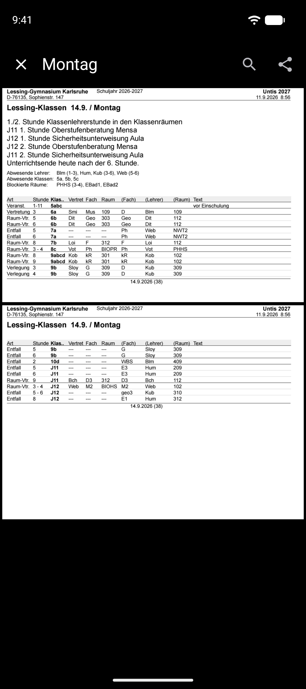<br><sub>de · phone · dark</sub></td>
<td align="center">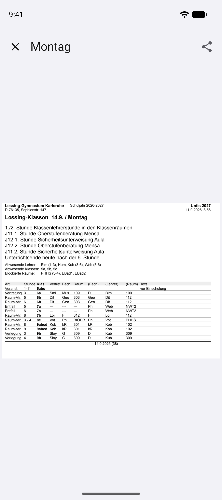<br><sub>de · phone · light</sub></td>
<td align="center">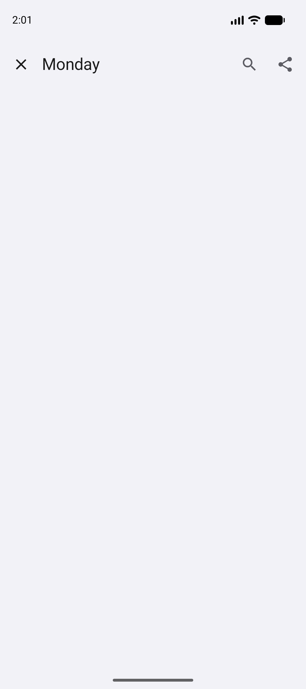<br><sub>en · phone · light</sub></td>
<td align="center"><br><sub>de · tablet · dark</sub></td>
</tr>
</table>

**Composition.** Full-screen `Dialog` → `Surface` → `Scaffold`. `TopAppBar`: **close (×)**, plan title
(`maxLines = 1`), search and share actions. Optional search row below the bar. Optional `primary` feedback
line. Then a `LazyColumn` of pages.

**Design notes**
- A dialog, not a route — it can be opened from several places and must return exactly where it came from.
- Pages are rasterized lazily at the container width, cached six at a time, and each page reserves its true
  aspect ratio before its bitmap exists, so scrolling never jumps.
- Pinch-zoom 1×–4× via `detectTransformGestures` into a `graphicsLayer`; panning only while zoomed.
- Search doubles as class switching: typing `j11` or `7b` selects that class and, if it lives in the other
  PDF, fetches that document and scrolls to the right page — always with a written confirmation.
- Share writes a friendly filename (`LGKA_Stundenplan_…`, `LGKA_Vertretungsplan_…`) and goes through
  `FileProvider`.
- Every page carries `a11y_page` ("Seite 3"); the match counter carries `a11y_match_position`.

**Source** `PdfViewer.kt` · **Related** [07 · Navigation §5.3](07-navigation.md#53-pdf-viewer--a-dialog-not-a-destination)

---

## 07 · Settings

<table>
<tr>
<td align="center">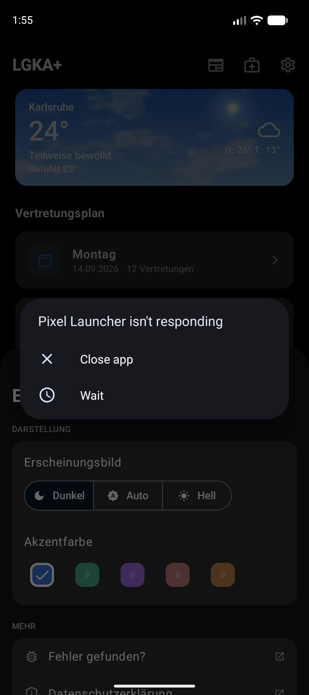<br><sub>de · phone · dark</sub></td>
<td align="center"><br><sub>de · phone · light</sub></td>
<td align="center">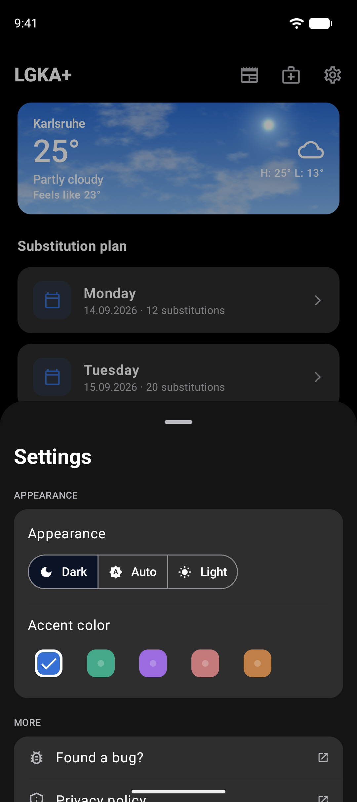<br><sub>en · phone · dark</sub></td>
<td align="center">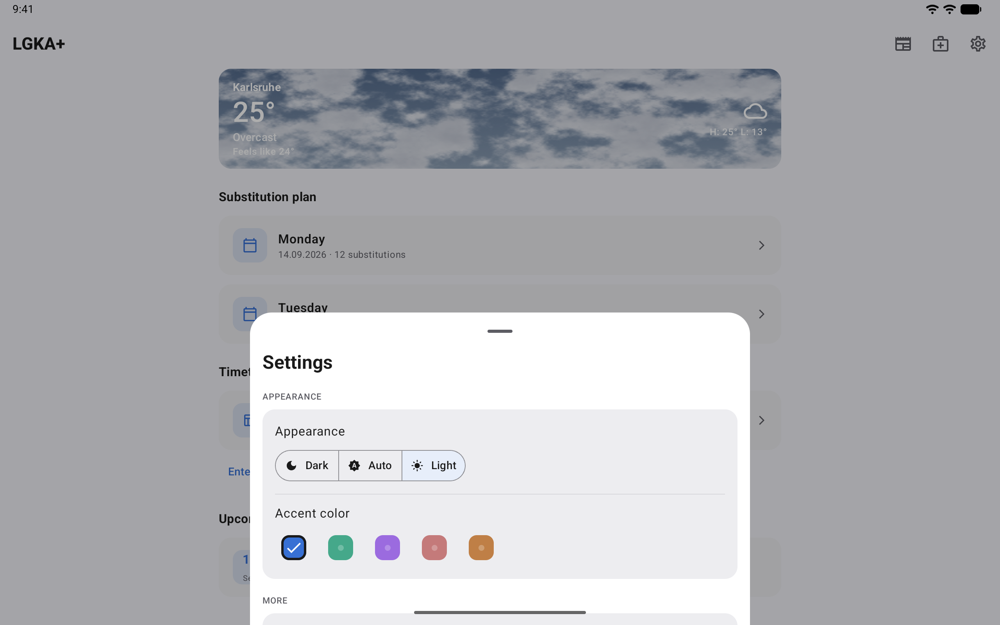<br><sub>en · tablet · light</sub></td>
</tr>
</table>

**Composition.** `ModalBottomSheet`, 16 dp horizontal padding, 32 dp bottom padding. Title, then two labelled
card groups (DARSTELLUNG, MEHR), then a centred footer. Full layout in
[06 · Components §5](06-components.md#5-bottom-sheet--settings).

**Design notes**
- A sheet, not a screen: settings are a brief detour from the hub, and the hub stays visible behind the scrim.
- `ThemeModeRow` and `AccentRow` are the **same composables** used in onboarding, at a 32 dp swatch size.
  One implementation, two contexts.
- Everything that leaves the app is marked with `OpenInNew`; "Abmelden" has no glyph and opens a confirmation.
- Copyright year is computed at runtime; version comes from `BuildConfig.VERSION_NAME`.

**Source** `Settings.kt` · **Related** [11 · Onboarding, login & privacy](11-onboarding-login-and-privacy.md)

---

## 08 · After login

<table>
<tr>
<td align="center">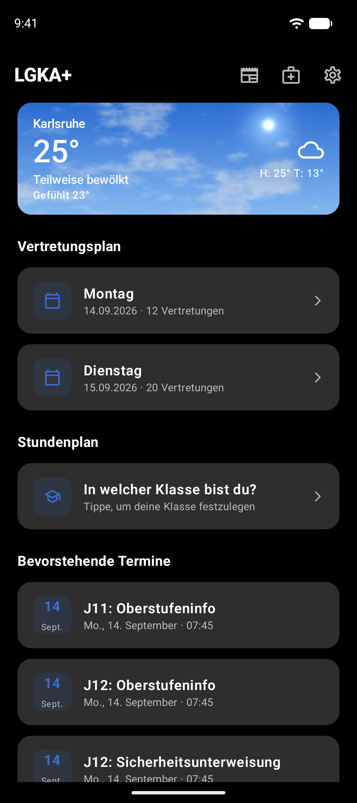<br><sub>de · phone · dark</sub></td>
<td align="center">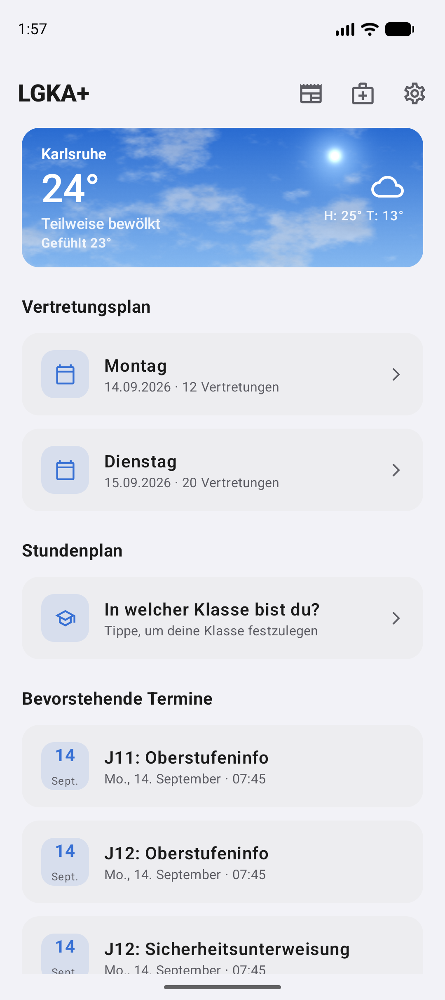<br><sub>de · phone · light</sub></td>
<td align="center">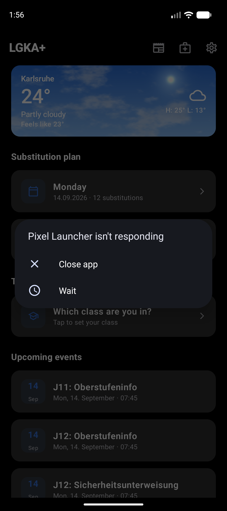<br><sub>en · phone · dark</sub></td>
<td align="center">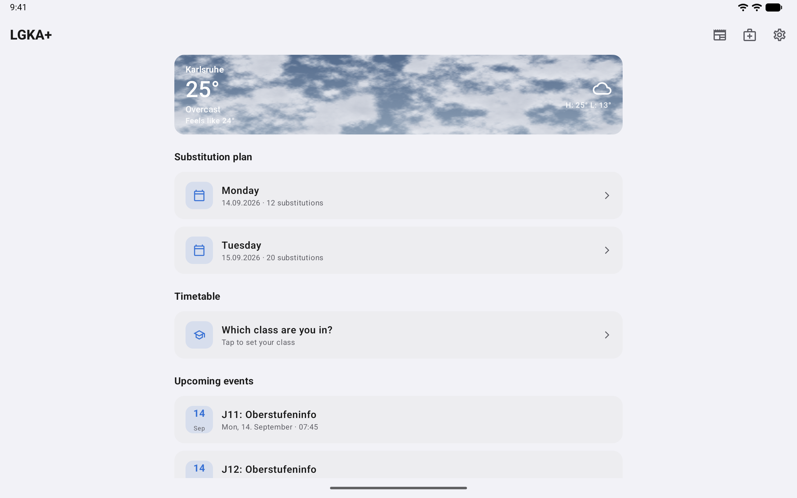<br><sub>en · tablet · light</sub></td>
</tr>
</table>

This is the home hub again, reached by driving the **real** flow: four "Weiter" taps, typed credentials, a
verified login. It exists as a regression guard, not as a distinct design — if it differs from `02_home`,
something is wrong with the login path.

**Source** `ScreenshotTest.t08LoginFlow`

---

## Screens the suite does not capture

| Screen | Why not | Source |
|---|---|---|
| Onboarding features / accent / appearance steps | Only step 1 is captured; the rest are transitional | `Onboarding.kt` |
| Login screen | Covered indirectly by `08_after_login` | `Onboarding.kt` `AuthScreen` |
| Krankmeldung info | Shown once per install, and only before the form | `WebScreen.kt` |
| Sick-note form / bug report (`WebScreen`) | Third-party web content; not ours to publish | `WebScreen.kt` |
| Class dialog | A transient `AlertDialog` | `Home.kt` `ClassDialog` |
| Error and empty states | No deterministic way to force them in the suite | `Home.kt`, `News.kt`, `Widgets.kt` |
| New Year fireworks | Date-gated to 1 January, Europe/Berlin | `Settings.kt` |

> **Note**
> The error and empty states are the most under-tested surfaces in the app, and they are exactly the ones
> a student meets on a bad-network morning. Review them by reading [06 · Components §9](06-components.md#9-lists--empty-states)
> when you change data loading.

## Related

[04 · Layout & spacing](04-layout-and-spacing.md) · [06 · Components](06-components.md) · [07 · Navigation](07-navigation.md) · [12 · Writing & localization](12-writing-and-localization.md)

## Sources

| Source | Accessed |
|---|---|
| App source: `kotlin/com/lgka/{Home,WeatherScreen,News,PdfViewer,Settings,Onboarding,WebScreen,MainActivity}.kt`, `androidTest/kotlin/com/lgka/ScreenshotTest.kt`, `scripts/screenshots.sh` | 2026-09-12 |
| [Material 3 — Cards guidelines](https://m3.material.io/components/cards/guidelines) | 2026-09-12 |
| [Android — Layout basics](https://developer.android.com/design/ui/mobile/guides/layout-and-content/layout-basics) | 2026-09-12 |
| [Android — System bars](https://developer.android.com/design/ui/mobile/guides/foundations/system-bars) | 2026-09-12 |
