# LGKA+ Android Design Guidelines

LGKA+ is the school app for the Lessing-Gymnasium Karlsruhe: substitution plans,
timetables, weather, news, school events and a sick-note form, for students and
parents. This folder documents how the Android app looks and behaves, and why.

These documents describe **one specific app**. They are not a general Material
tutorial. Where Google's guidance is the reason for a decision, it is quoted and
linked; where this app deliberately departs from the Material defaults, the
departure is named and justified.

## How to use these docs

- **Changing a colour, radius or motion value?** Read [02-color](02-color.md)
  and [05-shape-and-motion](05-shape-and-motion.md) first. Both are derived from
  `Theme.kt`; that file is the single source of truth, and these documents follow it.
- **Adding a screen?** Read [04-layout-edge-to-edge-and-navigation](04-layout-edge-to-edge-and-navigation.md)
  for insets and routing, then [06-components](06-components.md) for the
  component vocabulary already in use.
- **Adding an interactive element?** [07-accessibility](07-accessibility.md) lists
  the rules this app actually enforces, with `file:line` references to working examples.
- **Adding user-visible text?** [08-localization-and-writing](08-localization-and-writing.md).
- **Looking for the upstream rule?** [11-material-android-reference](11-material-android-reference.md)
  is a digest of the Material 3 and Android guidance behind all of the above,
  with per-section retrieval dates and verbatim quotes.

Every code reference in these files is written as `path:line` against the tree at
the time of writing. Line numbers drift; the surrounding symbol name is the
durable part.

## Contents

| File | Topic |
|---|---|
| [01-brand-identity.md](01-brand-identity.md) | What the app is, and the five design commitments that define it |
| [02-color.md](02-color.md) | Accent palette, computed contrast ratios, full light/dark role mapping |
| [03-typography.md](03-typography.md) | Type roles in use, weight as emphasis, the no-hardcoded-sp rule |
| [04-layout-edge-to-edge-and-navigation.md](04-layout-edge-to-edge-and-navigation.md) | Scaffold, insets, Navigation 3 routes, predictive back |
| [05-shape-and-motion.md](05-shape-and-motion.md) | Corner radii, `MotionScheme.expressive()`, springs, reduce-motion |
| [06-components.md](06-components.md) | Cards, app bars, pull-to-refresh, loading, sheets, dialogs, snackbars |
| [07-accessibility.md](07-accessibility.md) | Touch targets, semantics, headings, TalkBack, animation settings |
| [08-localization-and-writing.md](08-localization-and-writing.md) | German default, English translation, plurals, voice and tone |
| [09-privacy-and-backup.md](09-privacy-and-backup.md) | Credential handling, backup exclusions, what leaves the device |
| [10-launcher-icon.md](10-launcher-icon.md) | Adaptive icon layers, monochrome/themed icon, splash screen |
| [11-material-android-reference.md](11-material-android-reference.md) | Digest of the upstream Material 3 and Android guidance, with citations |

## The app

Captured on 2026-09-12 from a Pixel 9 emulator running Android 17 (API 37),
`google_apis` arm64 system image, app language forced to German with
`cmd locale set-app-locales com.lgka --locales de-DE`. Weather, news and events
are live data from the school's servers and Open-Meteo. Substitution plans read
"Noch keine Infos" because none were published at capture time; that empty state
is itself the designed state, not a failure.

### Onboarding

| Welcome | Features | Accent | Appearance | Login |
|---|---|---|---|---|
| 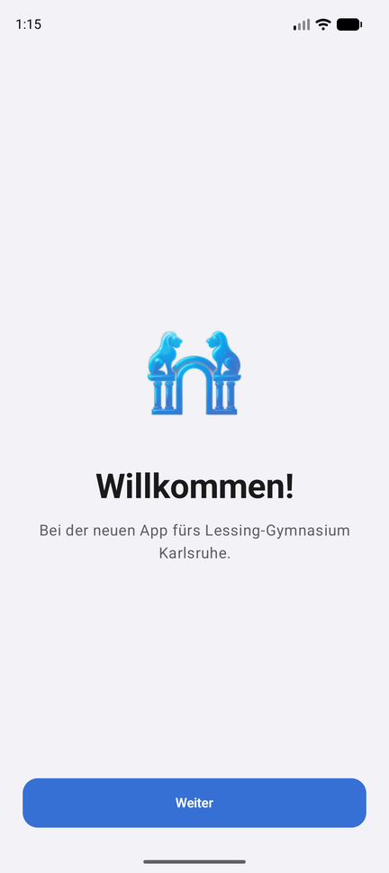 | 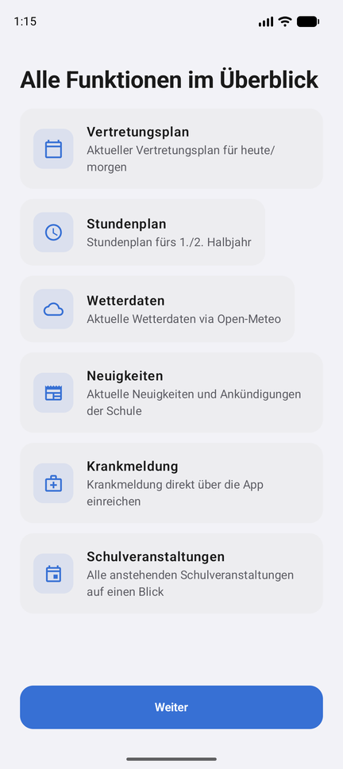 | 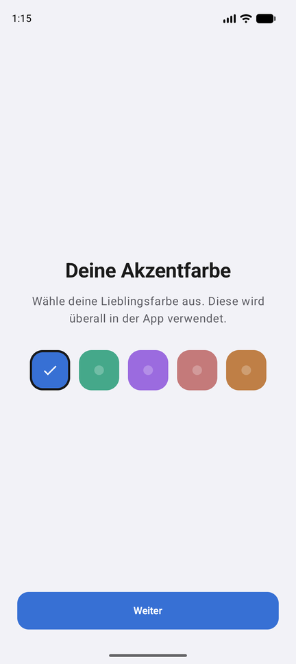 | 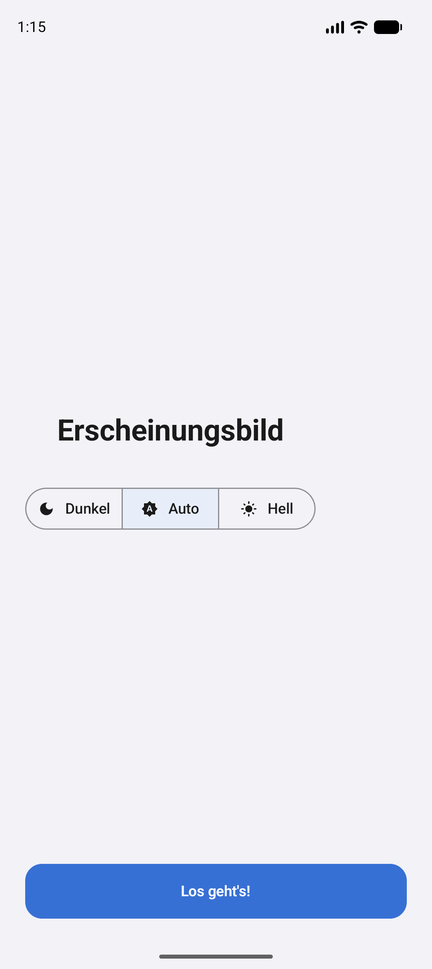 | 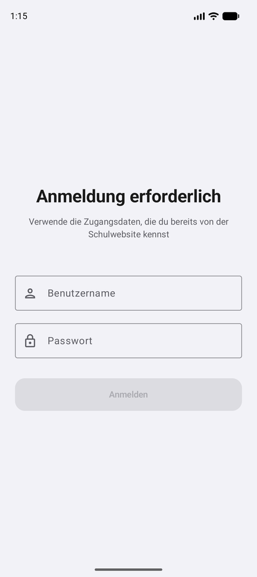 |

### Main app

| Home (light) | Home (dark) | Home (dark, mint) | Weather |
|---|---|---|---|
| 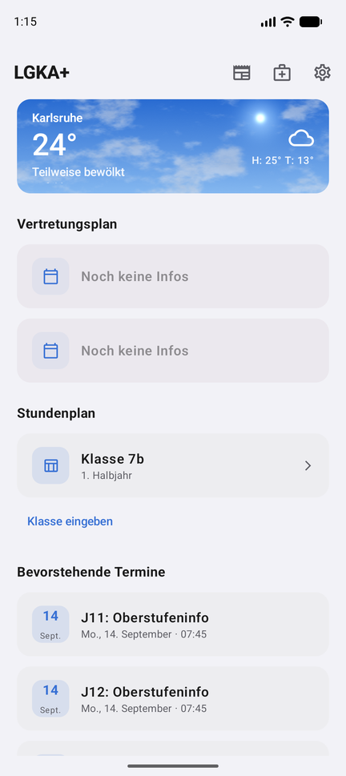 | 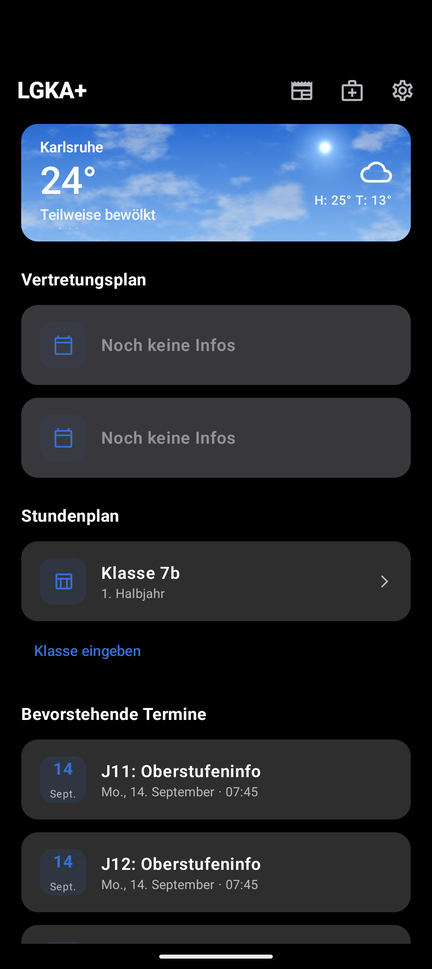 | 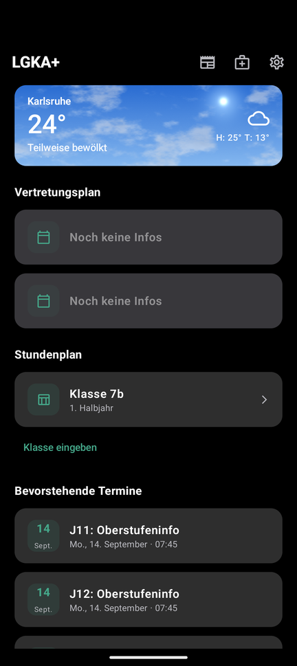 | 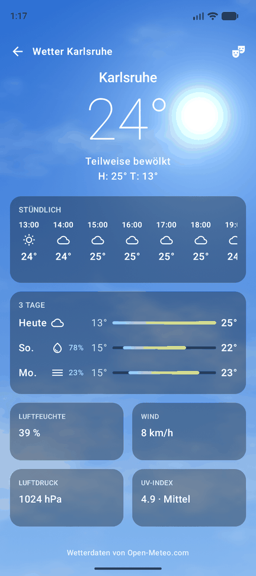 |

| News list | News detail | PDF viewer | Settings sheet |
|---|---|---|---|
| 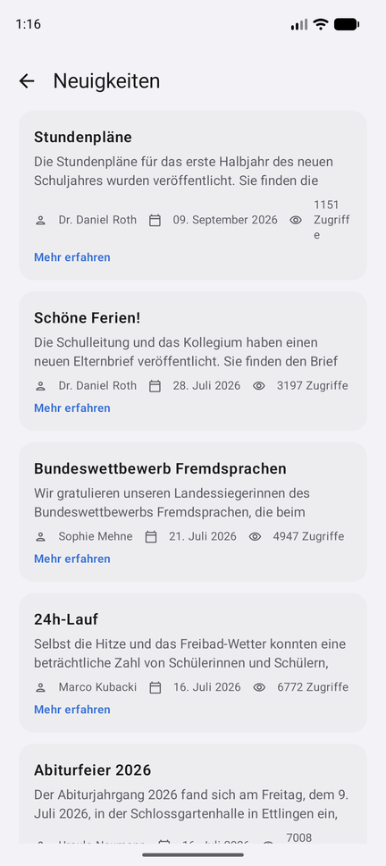 | 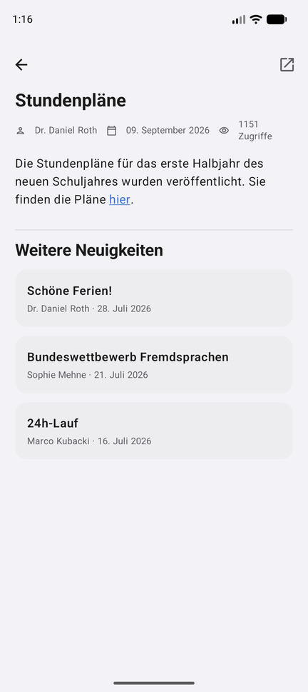 | 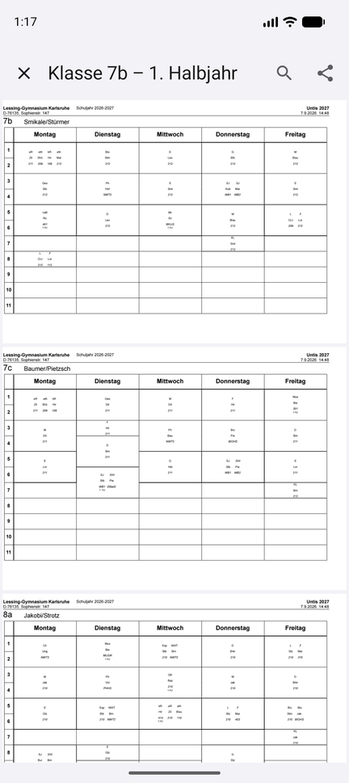 | 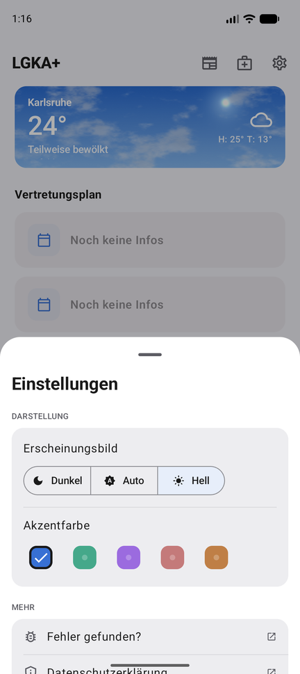 |

## Stack

| Thing | Value |
|---|---|
| Language | Kotlin 2.4.20 |
| UI | Jetpack Compose, Compose BOM 2026.09.00 |
| Design system | Material 3 Expressive, `material3` 1.5.0-alpha28 |
| Navigation | Navigation 3 (`androidx.navigation3`) 1.1.7 |
| Build | AGP 9.4.0, JVM target 17 |
| SDK | `minSdk` 29, `targetSdk` 37, `compileSdk` 37 |

Declared in `gradle/libs.versions.toml` and `app/build.gradle.kts:9`.
