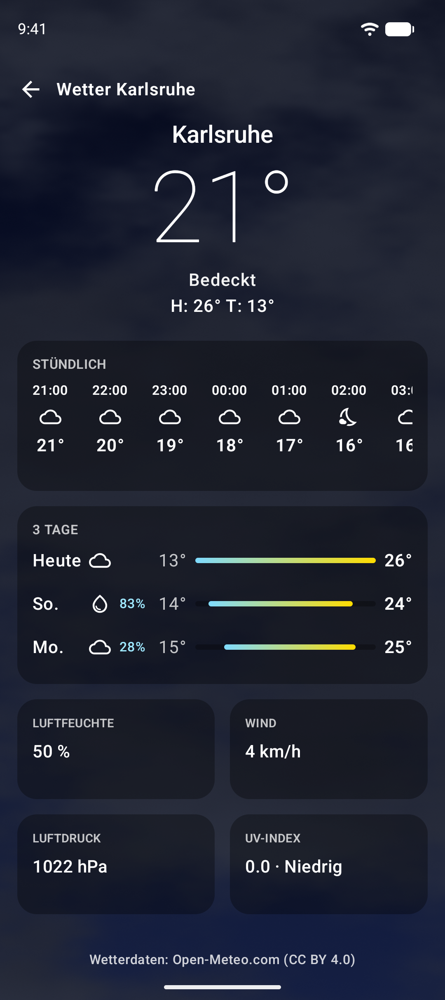
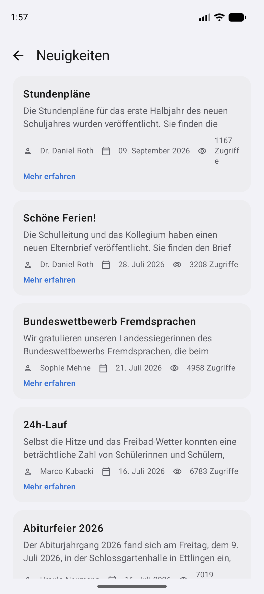
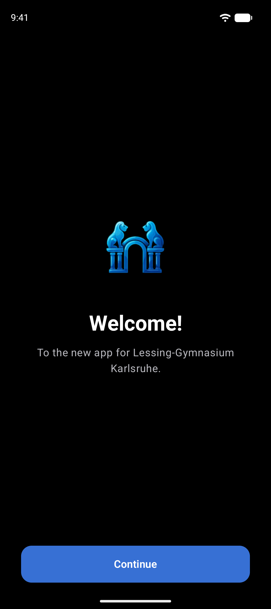
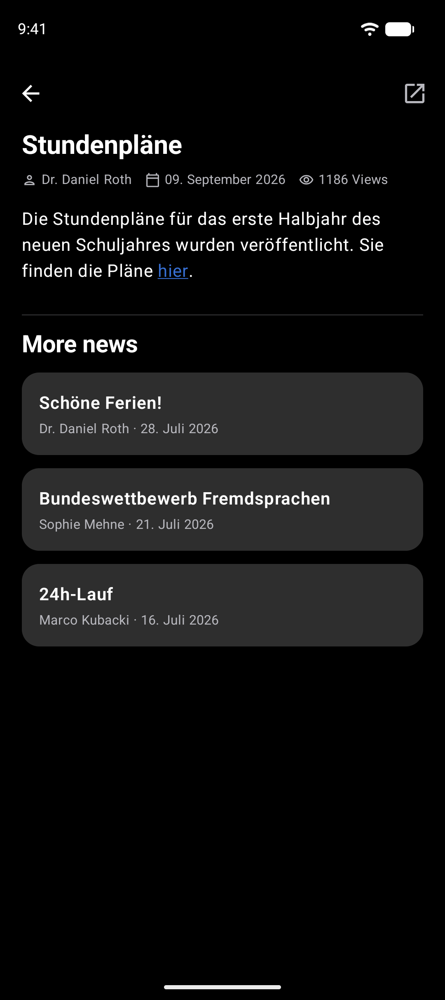
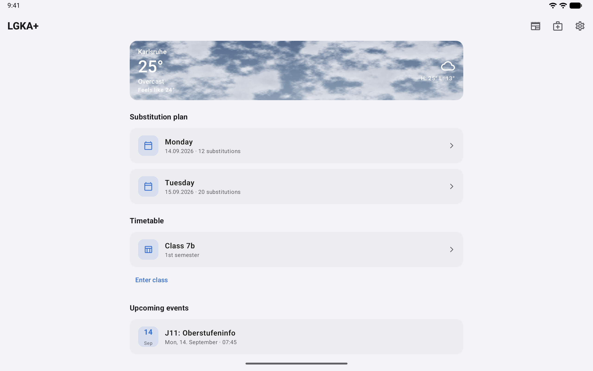
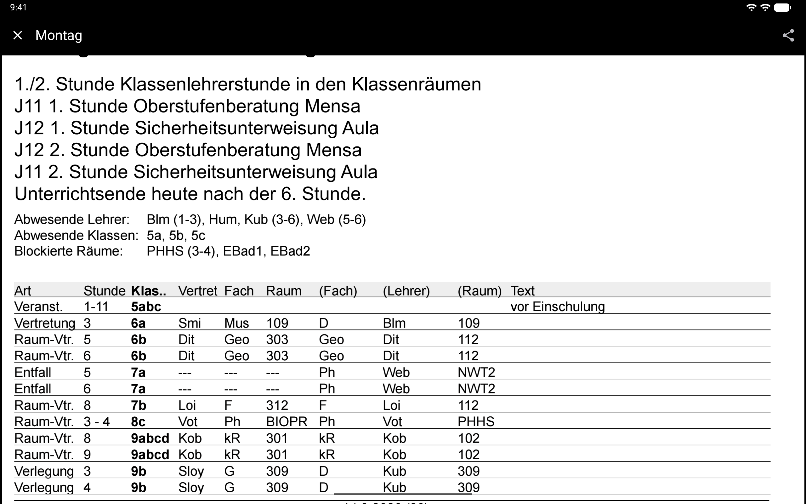

# LGKA+ Android — Design Guidelines

The design system of the native Android app for the **Lessing-Gymnasium Karlsruhe**:
what it looks like, why it looks that way, and which official guidance each rule comes from.

| | |
|---|---|
| **Last updated** | 2026-09-12 |
| **Applies to** | LGKA+ Android (`com.lgka`, versionName 3.0.0), Android 17 / API 37, minSdk 29 |
| **Design system** | Material 3 Expressive — Compose BOM 2026.09, `androidx.compose.material3` 1.5.0-alpha28, Navigation 3 |
| **Owner** | Luka Löhr (app author and maintainer) |
| **Status** | Living document — normative for `app/src/main/kotlin/com/lgka` |

---

## Purpose

These files are the reference for anyone changing LGKA+ Android UI. They exist so that:

- a new screen inherits the same colors, shapes, spacing and motion as the existing ones;
- every visual decision is **traceable** — to a line of app source or to a Material 3 / Android design doc;
- deviations from the official guidance are written down deliberately instead of discovered later.

> **Note**
> This is a *descriptive* design system. It documents the theme that `Theme.kt` actually builds,
> not an aspirational one. If code and document disagree, the code is the bug **or** the document is —
> decide which, then fix one of them in the same change.

## How to use

1. **Building a screen?** Read [04 · Layout & spacing](04-layout-and-spacing.md) and [06 · Components](06-components.md).
2. **Touching color?** [02 · Color](02-color.md) is normative. Never hardcode a hex outside the places it lists.
3. **Adding an interaction?** [08 · Motion & feedback](08-motion-and-feedback.md) and [10 · Accessibility](10-accessibility.md).
4. **Writing user-visible text?** [12 · Writing & localization](12-writing-and-localization.md) — every string is bilingual, no exceptions.
5. **Need the official wording?** [14 · Android reference](14-android-reference.md) carries a cited digest of every source doc, with a note on the five retired `design/ui/mobile/guides/…` URLs and where that guidance now lives.

## Table of contents

| # | File | What it covers |
|---|---|---|
| 01 | [Brand identity](01-brand-identity.md) | Name, adaptive & themed app icon, tone of voice, scope |
| 02 | [Color](02-color.md) | Full palette, role mapping, light/dark, accents, sky gradients, contrast |
| 03 | [Typography](03-typography.md) | Type scale, weights, where each style is used |
| 04 | [Layout & spacing](04-layout-and-spacing.md) | Margins, gaps, radii, edge-to-edge, system bars, large screens |
| 05 | [Material 3 Expressive](05-material-expressive.md) | `MaterialExpressiveTheme`, `MotionScheme.expressive()`, shapes, `LoadingIndicator` |
| 06 | [Components](06-components.md) | Cards, buttons, segmented buttons, sheets, fields, app bars |
| 07 | [Navigation](07-navigation.md) | Navigation 3 back stack, gating, PDF viewer, in-app browser, predictive back |
| 08 | [Motion & feedback](08-motion-and-feedback.md) | Springs, loading states, haptics, animation-off handling |
| 09 | [Iconography](09-iconography.md) | Material Symbols usage, WMO weather mapping, launcher icon |
| 10 | [Accessibility](10-accessibility.md) | Semantics, content descriptions, `testTag`, touch targets, contrast |
| 11 | [Onboarding, login & privacy](11-onboarding-login-and-privacy.md) | Five-step flow, credential storage, permissions, backup rules |
| 12 | [Writing & localization](12-writing-and-localization.md) | Copy rules for `de` and `en`, tone, formatting patterns |
| 13 | [Screens](13-screens.md) | Every screen, screenshot grid, per-screen design notes |
| 14 | [Android reference](14-android-reference.md) | Doc-by-doc cited digest of all 22 sources + how LGKA+ applies or deviates |

## Screenshot hero grid

Captures come from the instrumented suite (`app/src/androidTest/kotlin/com/lgka/ScreenshotTest.kt`,
driven by `scripts/screenshots.sh`) and land at a stable path:

```
app_store_assets/screenshots/<de|en>/android/<phone|tablet>/<dark|light>/NN_name.png
```

<table>
<tr>
<td align="center"><br><sub>de · phone · dark<br><b>02 Home</b></sub></td>
<td align="center"><br><sub>de · phone · dark<br><b>03 Weather</b></sub></td>
<td align="center"><br><sub>de · phone · light<br><b>04 News</b></sub></td>
<td align="center"><br><sub>de · phone · light<br><b>07 Settings</b></sub></td>
</tr>
<tr>
<td align="center"><br><sub>en · phone · dark<br><b>01 Welcome</b></sub></td>
<td align="center"><br><sub>en · phone · dark<br><b>05 News detail</b></sub></td>
<td align="center"><br><sub>en · tablet · light<br><b>02 Home</b></sub></td>
<td align="center"><br><sub>de · tablet · dark<br><b>06 Plan (PDF)</b></sub></td>
</tr>
</table>

> **Warning**
> Never hand-capture screenshots for this folder. The suite pins locale, theme, accent (`blue`),
> clock (09:41), battery and signal so that captures are comparable across runs. A manual capture
> breaks that and cannot be reproduced. Regenerate with `LGKA_LOGIN=user:pass scripts/screenshots.sh`.

## Conventions used in these files

- `> **Note**` — clarification; `> **Warning**` — something that will break if ignored.
- Blockquotes ending in `— [Doc title](URL)` are **verbatim** quotes from the cited source.
- Task lists mark do / don't checklists.
- Color swatches are 14×14 SVGs under [`assets/swatches/`](assets/swatches), referenced inline:
   `#3770D4`.
- Compose snippets are copied from the real source; the file path is always given.

## Sources

| Source | Accessed |
|---|---|
| [Material 3 — Color roles](https://m3.material.io/styles/color/roles) | 2026-09-12 |
| [Material 3 — Cards guidelines](https://m3.material.io/components/cards/guidelines) | 2026-09-12 |
| [Material 3 — Typography overview](https://m3.material.io/styles/typography/overview) | 2026-09-12 |
| [Material 3 — Layout overview](https://m3.material.io/foundations/layout/understanding-layout/overview) | 2026-09-12 |
| [Material 3 — Motion overview](https://m3.material.io/styles/motion/overview) | 2026-09-12 |
| [Material 3 — Shape overview & principles](https://m3.material.io/styles/shape/overview-principles) | 2026-09-12 |
| [Material 3 — Start building with M3 Expressive](https://m3.material.io/blog/building-with-m3-expressive) | 2026-09-12 |
| [Material 3 — Accessible design overview](https://m3.material.io/foundations/accessible-design/overview) | 2026-09-12 |
| [Android — Color for mobile design](https://developer.android.com/design/ui/mobile/guides/styles/color) | 2026-09-12 |
| [Android — System bars](https://developer.android.com/design/ui/mobile/guides/foundations/system-bars) | 2026-09-12 |
| [Android — Layout basics](https://developer.android.com/design/ui/mobile/guides/layout-and-content/layout-basics) | 2026-09-12 |
| [Android — Make apps more accessible](https://developer.android.com/guide/topics/ui/accessibility/apps) | 2026-09-12 |
| [Compose — Accessibility API defaults](https://developer.android.com/develop/ui/compose/accessibility/api-defaults) | 2026-09-12 |
| [Compose — Semantics](https://developer.android.com/develop/ui/compose/accessibility/semantics) | 2026-09-12 |
| [Compose — Material Design 3 in Compose](https://developer.android.com/develop/ui/compose/designsystems/material3) | 2026-09-12 |
| [Compose — Handling user interactions](https://developer.android.com/develop/ui/compose/touch-input/user-interactions/handling-interactions) | 2026-09-12 |
| [Android — What great technical quality looks like](https://developer.android.com/quality/technical) | 2026-09-12 |
| [Android — Implement dark theme](https://developer.android.com/develop/ui/views/theming/darktheme) | 2026-09-12 |
| [Android — Adaptive icons](https://developer.android.com/develop/ui/views/launch/icon_design_adaptive) | 2026-09-12 |
| [Compose — Navigation bar](https://developer.android.com/develop/ui/compose/components/navigation-bar) | 2026-09-12 |
| [Compose — Animation](https://developer.android.com/develop/ui/compose/animation/introduction) | 2026-09-12 |
| [Compose — Work with fonts](https://developer.android.com/develop/ui/compose/text/fonts) | 2026-09-12 |
| App source: `app/src/main/kotlin/com/lgka/*.kt`, `app/src/main/res/**`, `app/build.gradle.kts`, `gradle/libs.versions.toml` | 2026-09-12 |
